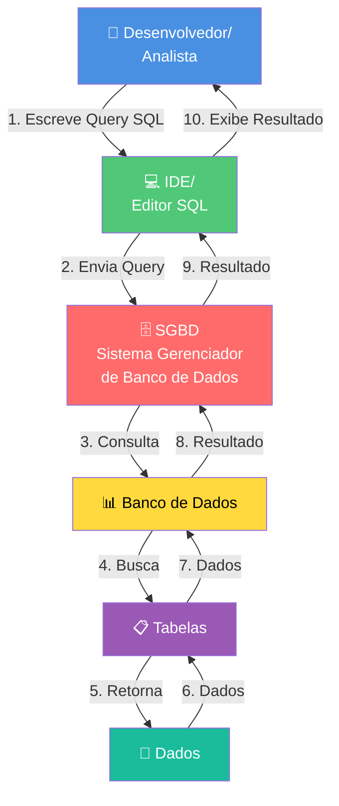

# 📚 Dia 1: SQL & Analytics | Jornada de Dados

Bem-vindo ao **primeiro dia da imersão Jornada de Dados**! Hoje você vai aprender SQL do zero, pensando como um analista de dados que precisa responder perguntas de negócio.

---

## 📖 O que é SQL?

**SQL** (Structured Query Language) é a linguagem padrão para trabalhar com bancos de dados relacionais. É a ferramenta que permite:

- ✅ **Consultar dados** - Extrair informações de tabelas
- ✅ **Analisar dados** - Calcular métricas, agregações e estatísticas
- ✅ **Manipular dados** - Inserir, atualizar e deletar registros
- ✅ **Estruturar dados** - Criar tabelas, relacionamentos e índices

**SQL não é uma linguagem de programação tradicional.** É uma linguagem declarativa: você descreve **o que quer**, não **como fazer**. O banco de dados decide a melhor forma de executar.

**Exemplo:**
```sql
-- Você diz: "Quero os produtos mais caros"
SELECT nome_produto, preco_atual 
FROM produtos 
ORDER BY preco_atual DESC 
LIMIT 10;

-- O banco decide como buscar isso de forma eficiente
```

---

## 💼 Mercado de SQL

SQL é uma das habilidades mais demandadas no mercado de dados e tecnologia:

### 📊 Por que SQL é importante?

1. **Universalidade**: Quase todos os bancos de dados relacionais usam SQL
2. **Demanda de mercado**: Uma das habilidades mais procuradas em vagas de dados
3. **Base para outras ferramentas**: BI tools (Power BI, Tableau), Python (pandas), R, etc.
4. **Carreira**: Analista de Dados, Cientista de Dados, Engenheiro de Dados, todos precisam de SQL

### 🎯 Onde SQL é usado?

- **Análise de Negócio**: Responder perguntas estratégicas
- **Business Intelligence**: Criar dashboards e relatórios
- **Data Science**: Preparar e explorar dados
- **Desenvolvimento**: Backend de aplicações
- **Data Engineering**: Transformar e mover dados

### 💰 Salários no Brasil (2024)

- **Analista de Dados Júnior**: R$ 3.000 - R$ 6.000
- **Analista de Dados Pleno**: R$ 6.000 - R$ 10.000
- **Analista de Dados Sênior**: R$ 10.000 - R$ 18.000
- **Cientista de Dados**: R$ 8.000 - R$ 20.000+
- **Engenheiro de Dados**: R$ 10.000 - R$ 25.000+

**SQL é a base de todas essas carreiras.**

---

## 🛠️ Plataforma para Aprender SQL

Existem várias plataformas e bancos de dados para aprender SQL:

### Opções Disponíveis:

- **PostgreSQL** - Banco open-source robusto e completo
- **MySQL** - Um dos mais populares
- **SQLite** - Banco leve, perfeito para começar
- **Microsoft SQL Server** - Solução enterprise da Microsoft
- **Oracle** - Banco enterprise robusto
- **AWS RDS** - PostgreSQL/MySQL na nuvem AWS
- **Azure SQL** - Solução cloud da Microsoft
- **Supabase** - Plataforma moderna com PostgreSQL + ferramentas extras

### 🚀 Por que vamos usar Supabase?

Neste curso, vamos usar **[Supabase](https://supabase.com/)** porque:

✅ **PostgreSQL completo** - Banco de dados profissional e robusto  
✅ **Interface web** - Editor SQL integrado, fácil de usar  
✅ **Gratuito** - Plano free generoso para aprender  
✅ **Moderno** - Ferramentas extras (Auth, Storage, Realtime)  
✅ **Fácil setup** - Criação de projeto em minutos  
✅ **Documentação excelente** - Recursos e tutoriais completos  

**Supabase é essencialmente PostgreSQL com uma interface moderna e ferramentas extras.** Tudo que você aprender aqui funciona em qualquer PostgreSQL.

---

## 🎓 Introdução ao SQL

### O que é um Banco de Dados?

Um **banco de dados** é uma coleção organizada de dados estruturados, armazenados eletronicamente. É como uma biblioteca digital onde:

- **Tabelas** = Prateleiras organizadas
- **Linhas (registros)** = Livros individuais
- **Colunas (campos)** = Informações sobre cada livro (título, autor, ano)

**Exemplo prático:**
```
Banco de Dados: E-commerce
├── Tabela: produtos (200 produtos)
├── Tabela: clientes (50 clientes)
├── Tabela: vendas (3.000 vendas)
└── Tabela: preco_competidores (680 preços)
```

### O que é uma Tabela?

Uma **tabela** é uma estrutura bidimensional que organiza dados em:

- **Linhas (Rows)**: Cada linha representa um registro único
- **Colunas (Columns)**: Cada coluna representa um atributo/campo

**Exemplo de tabela `produtos`:**

| id_produto | nome_produto | categoria | marca | preco_atual |
|------------|--------------|-----------|-------|-------------|
| prd_001 | Smartphone Galaxy A54 | Eletrônicos | Samsung | 1299.90 |
| prd_002 | Panela de Pressão | Cozinha | Tramontina | 89.90 |
| prd_003 | Tênis Nike Air Max | Tênis | Nike | 599.90 |

**Características:**
- Cada linha é única (identificada por `id_produto`)
- Cada coluna tem um tipo de dado (texto, número, data)
- Tabelas podem se relacionar entre si (relacionamentos)

### 🔄 Fluxo de Trabalho com SQL

O fluxo de trabalho com SQL é **bidirecional**: você envia uma consulta e recebe os dados de volta.



**Explicação do fluxo (ida e volta):**

**🔄 IDA (Enviando a Query):**
1. **Desenvolvedor/Analista**: Você escreve a query SQL (ex: `SELECT * FROM produtos`)
2. **IDE/Editor SQL**: A query é enviada através da ferramenta (Supabase SQL Editor, DBeaver, pgAdmin, etc.)
3. **SGBD**: O Sistema Gerenciador de Banco de Dados recebe e processa a query
4. **Banco de Dados**: O SGBD acessa o banco específico (ex: `ecommerce_db`)
5. **Tabelas**: O banco busca nas tabelas (ex: `produtos`, `vendas`)
6. **Dados**: Os dados são localizados e preparados

**↩️ VOLTA (Recebendo os Dados):**
7. **Dados → Tabelas**: Os dados são retornados das tabelas
8. **Tabelas → Banco**: O banco organiza os resultados
9. **Banco → SGBD**: O SGBD processa e formata os resultados
10. **SGBD → IDE**: Os resultados são enviados de volta para o editor
11. **IDE → Você**: Você visualiza os dados na tela

**No nosso caso:**
- **Você** escreve no **Supabase SQL Editor** → **PostgreSQL** consulta → **Dados retornam** → **Você vê o resultado**

**Exemplo prático:**
```sql
-- Você escreve isso:
SELECT nome_produto, preco_atual 
FROM produtos 
WHERE categoria = 'Eletrônicos';

-- O fluxo acontece automaticamente:
-- 1. Query vai → PostgreSQL
-- 2. PostgreSQL busca → Tabela produtos
-- 3. Dados voltam → Supabase SQL Editor
-- 4. Você vê → Resultado na tela
```

---

## 📝 Comandos SQL - Categorias

SQL é dividido em categorias de comandos baseados em sua função:

### 1. **DDL - Data Definition Language** (Linguagem de Definição de Dados)

Comandos para **criar, modificar e excluir estruturas** de banco de dados:

```sql
-- Criar estruturas
CREATE TABLE produtos (...);
CREATE DATABASE ecommerce;
CREATE VIEW produtos_vendidos AS (...);
CREATE INDEX idx_categoria ON produtos(categoria);

-- Modificar estruturas
ALTER TABLE produtos ADD COLUMN descricao TEXT;
ALTER TABLE produtos MODIFY COLUMN preco_atual DECIMAL(10,2);

-- Excluir estruturas
DROP TABLE produtos;
DROP DATABASE ecommerce;
DROP VIEW produtos_vendidos;
```

**Comandos DDL:**
- `CREATE` - Criar tabelas, bancos, views, índices
- `ALTER` - Modificar estruturas existentes
- `DROP` - Excluir estruturas
- `TRUNCATE` - Limpar dados de uma tabela (mantém estrutura)

---

### 2. **DML - Data Manipulation Language** (Linguagem de Manipulação de Dados)

Comandos para **inserir, atualizar e deletar dados**:

```sql
-- Inserir dados
INSERT INTO produtos (nome_produto, categoria, preco_atual)
VALUES ('Smartphone Galaxy A54', 'Eletrônicos', 1299.90);

-- Atualizar dados
UPDATE produtos 
SET preco_atual = 1199.90 
WHERE id_produto = 'prd_001';

-- Deletar dados
DELETE FROM produtos 
WHERE categoria = 'Tênis';
```

**Comandos DML:**
- `INSERT` - Inserir novos registros
- `UPDATE` - Atualizar registros existentes
- `DELETE` - Deletar registros
- `MERGE` - Inserir ou atualizar (upsert)

---

### 3. **DQL - Data Query Language** (Linguagem de Consulta de Dados)

Comandos para **consultar e recuperar dados**:

```sql
-- Consultar dados
SELECT nome_produto, preco_atual 
FROM produtos 
WHERE categoria = 'Eletrônicos'
ORDER BY preco_atual DESC;

-- Agregações
SELECT categoria, COUNT(*) as total
FROM produtos
GROUP BY categoria;

-- JOINs
SELECT p.nome_produto, v.quantidade
FROM produtos p
INNER JOIN vendas v ON p.id_produto = v.id_produto;
```

**Comando DQL:**
- `SELECT` - Consultar e recuperar dados (o mais usado!)

**Neste curso, focamos principalmente em DQL (SELECT)** porque é o que analistas de dados mais usam.

---

### 4. **DCL - Data Control Language** (Linguagem de Controle de Dados)

Comandos para **controlar acesso e permissões**:

```sql
-- Conceder permissões
GRANT SELECT ON produtos TO analista;
GRANT INSERT, UPDATE ON vendas TO vendedor;

-- Revogar permissões
REVOKE DELETE ON produtos FROM usuario;
```

**Comandos DCL:**
- `GRANT` - Conceder permissões
- `REVOKE` - Revogar permissões

**Nota:** Em ambientes de aprendizado (como Supabase), você geralmente tem todas as permissões. Em produção, DCL é crucial para segurança.

---

### 5. **TCL - Transaction Control Language** (Linguagem de Controle de Transações)

Comandos para **controlar transações** (agrupar operações):

```sql
-- Iniciar transação
BEGIN;

-- Operações
INSERT INTO produtos (...) VALUES (...);
UPDATE produtos SET preco_atual = 100 WHERE id = 1;

-- Confirmar (salvar)
COMMIT;

-- Ou cancelar (desfazer)
ROLLBACK;
```

**Comandos TCL:**
- `BEGIN` - Iniciar transação
- `COMMIT` - Confirmar e salvar mudanças
- `ROLLBACK` - Cancelar e desfazer mudanças
- `SAVEPOINT` - Ponto de salvamento dentro da transação

**Nota:** Transações garantem que operações múltiplas sejam executadas juntas ou nenhuma seja executada (atomicidade).

---

## 🎯 Foco do Curso

Neste **Dia 1**, vamos focar em:

✅ **DQL (SELECT)** - 90% do tempo  
✅ **DDL básico** - CREATE VIEW, CREATE TABLE (exemplos finais)  
✅ **Conceitos fundamentais** - JOINs, agregações, filtros  

**Por quê?** Analistas de dados passam 90% do tempo consultando dados, não criando estruturas. Você vai aprender a **pensar com dados** e **responder perguntas de negócio**.

---

## 🎯 Perguntas de Negócio que Vamos Responder

Este **Dia 1** foi criado para responder perguntas reais de negócio usando SQL. Abaixo estão todas as perguntas que vamos responder com os 21 exemplos:

### 📊 Análise de Produtos

1. **Quais produtos temos no catálogo?** *(Exemplo 1)*
2. **Quais são os produtos mais caros?** *(Exemplo 2)*
3. **Quais são os 10 primeiros produtos mais caros?** *(Exemplo 3)*
4. **Quais produtos custam mais de R$ 500?** *(Exemplo 4)*
5. **Quais produtos nunca foram vendidos?** *(Exemplo 15)*
6. **Classifique os produtos por faixa de preço** *(Exemplo 7)*
7. **Quais produtos têm preço acima da média geral?** *(Exemplo 12)*

### 💰 Análise de Vendas

8. **Qual é o total de vendas, receita total e ticket médio?** *(Exemplo 5)*
9. **Qual é a maior e menor venda?** *(Exemplo 5)*
10. **Quantos produtos diferentes foram vendidos?** *(Exemplo 5)*
11. **Como ver o nome do produto junto com a venda?** *(Exemplo 6)*
12. **Quantas vendas e qual a receita total por categoria?** *(Exemplo 8)*
13. **Quais categorias geram mais de R$ 50.000 em receita?** *(Exemplo 9)*
14. **Qual é a distribuição percentual de receita por canal?** *(Exemplo 17)*
15. **Quais vendas foram feitas de produtos não cadastrados?** *(Exemplo 14)*

### 👥 Análise de Clientes

16. **Quem são nossos clientes?** *(Criar segmentação usando CASE WHEN - Exercício 22)*
17. **Quais clientes compram mais?** *(Usar agregações com JOIN)*

### 🏪 Análise Competitiva

18. **Quais produtos estão mais caros que a média dos concorrentes?** *(Exemplo 13)*
19. **Quais produtos estão mais baratos no concorrente do que na nossa tabela?** *(Exemplo 16)*
20. **Qual é a diferença percentual entre nossos preços e dos concorrentes?** *(Exemplo 16)*
21. **Quais produtos top sellers estão mais caros que todos os concorrentes?** *(Exemplo 18)*

### 📈 Análises Avançadas

22. **Qual é a receita total por categoria?** *(Exemplo 8)*
23. **Quais categorias geram mais de R$ 50.000 em receita?** *(Exemplo 9)*
24. **Qual é o ticket médio por segmento de cliente?** *(Criar segmentação com CASE WHEN)*
25. **Quais produtos têm preço acima da média geral?** *(Exemplo 12)*
26. **Quais produtos estão mais caros que a média dos concorrentes?** *(Exemplo 13)*

### 🏗️ Estruturas de Dados

27. **Como criar uma visão para produtos com vendas?** *(Exemplo 19)*
28. **Como criar uma tabela para armazenar resumo de vendas por categoria?** *(Exemplo 20)*
29. **Como criar uma visão temporária para análise rápida?** *(Exemplo 21)*

---

**Total: 29 perguntas de negócio respondidas com SQL!** 🚀

Cada exemplo foi criado para responder uma pergunta real que um analista de dados enfrenta no dia a dia. Sempre pergunte: **"Por que isso importa para o negócio?"**

---

## 🎯 Progressão de Aprendizado

### 📊 Nível 1: Fundamentos (Exemplos 1-4)

#### `exemplo-01-select-basico.sql`
**Conceito:** SELECT básico  
**Pergunta de Negócio:** Quais produtos temos no catálogo?  
**O que você aprende:**
- Como selecionar colunas específicas de uma tabela
- Sintaxe básica do SELECT
- Como visualizar dados de uma tabela

**Conceitos SQL:**
- `SELECT`: comando para selecionar dados
- `FROM`: especifica a tabela de origem
- Seleção de colunas específicas

**Resultado Esperado:**
- **Total de linhas:** 200 (todos os produtos)
- **Colunas retornadas:** `id_produto`, `nome_produto`, `categoria`, `marca`, `preco_atual`
- **Exemplo de linha:**
  ```
  id_produto: prd_abc123def456
  nome_produto: Smartphone Galaxy A54
  categoria: Eletrônicos
  marca: Samsung
  preco_atual: 1299.90
  ```
- **Validação:** Verifique se todos os 200 produtos aparecem e se os nomes são produtos brasileiros reais

---

#### `exemplo-02-order-by.sql`
**Conceito:** ORDER BY (Ordenação)  
**Pergunta de Negócio:** Quais são os produtos mais caros?  
**O que você aprende:**
- Como ordenar resultados por uma ou mais colunas
- Ordenação crescente (ASC) e decrescente (DESC)
- Como organizar dados para análise

**Conceitos SQL:**
- `ORDER BY`: ordena os resultados
- `ASC`: ordem crescente (padrão)
- `DESC`: ordem decrescente

**Resultado Esperado:**
- **Total de linhas:** 200 (todos os produtos)
- **Colunas retornadas:** `nome_produto`, `categoria`, `marca`, `preco_atual`
- **Ordenação:** Do mais caro para o mais barato (DESC)
- **Primeira linha:** Produto com maior `preco_atual` (pode variar, mas deve estar acima de R$ 500)
- **Última linha:** Produto com menor `preco_atual` (geralmente próximo de R$ 29,90)
- **Validação:** Verifique se os preços estão em ordem decrescente

---

#### `exemplo-03-limit.sql`
**Conceito:** LIMIT (Limitar Resultados)  
**Pergunta de Negócio:** Quais são os 10 primeiros produtos mais caros?  
**O que você aprende:**
- Como limitar a quantidade de registros retornados
- Combinar LIMIT com ORDER BY para obter top N
- Útil para análises de ranking

**Conceitos SQL:**
- `LIMIT`: limita o número de linhas retornadas
- Combinação com `ORDER BY` para rankings

**Resultado Esperado:**
- **Total de linhas:** Exatamente 10 linhas
- **Colunas retornadas:** `nome_produto`, `categoria`, `marca`, `preco_atual`
- **Ordenação:** Do mais caro para o mais barato (DESC)
- **Validação:** 
  - Deve retornar exatamente 10 produtos
  - Todos devem ter preço acima de R$ 500 (geralmente)
  - Os preços devem estar em ordem decrescente

---

#### `exemplo-04-where.sql`
**Conceito:** WHERE (Filtros)  
**Pergunta de Negócio:** Quais produtos custam mais de R$ 500?  
**O que você aprende:**
- Como filtrar registros com condições
- Operadores de comparação (>, <, =, >=, <=, !=)
- Como combinar múltiplas condições (AND, OR)

**Conceitos SQL:**
- `WHERE`: filtra linhas baseado em condições
- Operadores: `>`, `<`, `=`, `>=`, `<=`, `!=`, `<>`
- Operadores lógicos: `AND`, `OR`, `NOT`

**Resultado Esperado:**
- **Total de linhas:** Aproximadamente 30-50 produtos (varia conforme dados gerados)
- **Colunas retornadas:** `nome_produto`, `categoria`, `marca`, `preco_atual`
- **Filtro aplicado:** Apenas produtos com `preco_atual > 500`
- **Validação:** 
  - Todas as linhas devem ter `preco_atual` maior que 500
  - Nenhuma linha deve ter `preco_atual` menor ou igual a 500

---

### 📈 Nível 2: Agregações (Exemplo 5)

#### `exemplo-05-funcoes-agregacao.sql`
**Conceito:** Funções de Agregação  
**Pergunta de Negócio:** Qual é o total de vendas, receita total e ticket médio?  
**O que você aprende:**
- Como calcular totais, médias e contagens
- Funções de agregação básicas e avançadas
- Diferença entre COUNT(*) e COUNT(coluna)

**Conceitos SQL:**
- `COUNT()`: conta registros
- `SUM()`: soma valores
- `AVG()`: calcula média
- `MAX()`: maior valor
- `MIN()`: menor valor
- `COUNT(DISTINCT)`: conta valores únicos

**Exemplos incluídos:**
- Total de vendas e receita
- Maior e menor venda
- Produtos e clientes únicos
- Resumo completo de métricas

**Resultado Esperado:**

**5A - Total de Vendas e Receita:**
- **Total de linhas:** 1 linha
- **Colunas:** `total_vendas`, `total_unidades_vendidas`, `receita_total`, `ticket_medio`
- **Valores esperados:**
  - `total_vendas`: ~3.000 (varia conforme dados)
  - `receita_total`: Valor em R$ (soma de todas as vendas)
  - `ticket_medio`: Receita total / total de vendas

**5B - MAX e MIN:**
- **Total de linhas:** 1 linha
- **Colunas:** `maior_venda`, `menor_venda`, `maior_preco_unitario`, `menor_preco_unitario`
- **Validação:** `maior_venda` deve ser maior que `menor_venda`

**5C - COUNT com DISTINCT:**
- **Total de linhas:** 1 linha
- **Colunas:** `produtos_diferentes_vendidos`, `clientes_unicos`, `total_vendas`
- **Valores esperados:**
  - `produtos_diferentes_vendidos`: ~185 produtos (alguns não são vendidos)
  - `clientes_unicos`: ~50 clientes (todos compram)
  - `total_vendas`: ~3.000

**5D - Resumo Completo:**
- **Total de linhas:** 1 linha
- **Colunas:** Todas as métricas combinadas
- **Validação:** Todos os valores devem fazer sentido (receita > 0, ticket médio razoável)

---

### 🔗 Nível 3: Relacionamentos (Exemplos 6, 8, 9)

#### `exemplo-06-join.sql`
**Conceito:** JOIN - Primeiro Passo  
**Pergunta de Negócio:** Como ver o nome do produto junto com a venda?  
**O que você aprende:**
- O que é JOIN e por que é necessário
- Como juntar duas tabelas pelo relacionamento
- Diferença entre dados em tabelas separadas vs. juntos

**Conceitos SQL:**
- `INNER JOIN`: junta tabelas retornando apenas matches
- Sintaxe: `FROM tabela1 t1 INNER JOIN tabela2 t2 ON t1.coluna = t2.coluna`
- Aliases de tabela (apelidos)
- Especificar tabela nas colunas (t.coluna)

**Como funciona:**
1. Pegamos uma linha da tabela da esquerda
2. Procuramos correspondência na tabela da direita
3. Combinamos as informações quando há match
4. Resultado: uma linha com dados de ambas as tabelas

**Resultado Esperado:**
- **Total de linhas:** 10 linhas (LIMIT 10)
- **Colunas retornadas:** `id_venda`, `id_produto`, `nome_produto`, `quantidade`
- **Estrutura:** Cada linha combina dados de `vendas` e `produtos`
- **Exemplo de linha:**
  ```
  id_venda: sal_xyz789
  id_produto: prd_abc123
  nome_produto: Smartphone Galaxy A54
  quantidade: 1
  ```
- **Validação:** 
  - Todas as linhas devem ter `nome_produto` preenchido (não NULL)
  - O `id_produto` deve existir na tabela `produtos`

---

#### `exemplo-08-group-by-join.sql`
**Conceito:** GROUP BY com JOIN  
**Pergunta de Negócio:** Quantas vendas e qual a receita total por categoria de produto?  
**O que você aprende:**
- Como agrupar dados de tabelas juntadas
- Combinar GROUP BY com JOIN
- Calcular métricas agregadas por grupos de tabelas relacionadas

**Conceitos SQL:**
- `GROUP BY`: agrupa linhas por valores de colunas
- Regra importante: todas as colunas no SELECT devem estar no GROUP BY ou serem funções de agregação
- Múltiplas funções de agregação no mesmo SELECT

**Progressão didática:**
- 8A: Apenas categoria e total de vendas
- 8B: Adiciona receita total
- 8C: Análise completa (vendas, receita, preço médio)

**Resultado Esperado:**

**8A - Categoria e Total de Vendas:**
- **Total de linhas:** ~10-11 linhas (uma por categoria)
- **Colunas:** `categoria`, `total_vendas`
- **Ordenação:** Do maior para o menor número de vendas
- **Validação:** A soma de `total_vendas` deve ser igual ao total de vendas

**8B - Adicionando Receita Total:**
- **Total de linhas:** ~10-11 linhas
- **Colunas:** `categoria`, `total_vendas`, `receita_total`
- **Validação:** Categorias com mais vendas geralmente têm maior receita

**8C - Análise Completa:**
- **Total de linhas:** ~10-11 linhas
- **Colunas:** `categoria`, `total_vendas`, `receita_total`, `preco_medio`
- **Validação:** 
  - `receita_total` = soma de todas as vendas da categoria
  - `preco_medio` deve estar dentro da faixa de preços dos produtos

---

#### `exemplo-09-having-join.sql`
**Conceito:** HAVING com JOIN  
**Pergunta de Negócio:** Quais categorias geram mais de R$ 50.000 em receita?  
**O que você aprende:**
- Diferença entre WHERE e HAVING
- Filtrar resultados após agrupamento
- Aplicar condições em funções de agregação

**Conceitos SQL:**
- `HAVING`: filtra grupos após agrupamento (WHERE filtra linhas antes)
- Usado com funções de agregação
- Ordem: WHERE → GROUP BY → HAVING → ORDER BY

**Diferença WHERE vs HAVING:**
- `WHERE`: filtra linhas individuais ANTES do agrupamento
- `HAVING`: filtra grupos DEPOIS do agrupamento

**Resultado Esperado:**
- **Total de linhas:** 1-5 linhas (apenas categorias com receita > R$ 50.000)
- **Colunas:** `categoria`, `receita_total`
- **Filtro:** Apenas categorias onde `receita_total > 50000`
- **Validação:** 
  - Todas as linhas devem ter `receita_total` maior que 50.000
  - Geralmente categorias como "Eletrônicos" e "Informática" aparecem

---

### 🧠 Nível 4: Lógica e Transformações (Exemplo 7)

#### `exemplo-07-case-when.sql`
**Conceito:** CASE WHEN (Lógica Condicional)  
**Pergunta de Negócio:** Classifique os produtos por faixa de preço  
**O que você aprende:**
- Como criar classificações e categorizações
- Lógica condicional em SQL
- Criar novas colunas baseadas em condições

**Conceitos SQL:**
- `CASE WHEN`: estrutura condicional (como IF/ELSE)
- Sintaxe: `CASE WHEN condição THEN valor ELSE outro_valor END`
- Múltiplas condições com WHEN/THEN
- Criar colunas calculadas com lógica

**Casos de uso:**
- Classificações (Econômico, Médio, Alto, Premium)
- Segmentações
- Transformações de dados
- Flags e indicadores

**Resultado Esperado:**
- **Total de linhas:** 200 (todos os produtos)
- **Colunas:** `nome_produto`, `preco_atual`, `faixa_preco`
- **Classificações:**
  - `Econômico`: preço < R$ 100
  - `Médio`: preço entre R$ 100 e R$ 300
  - `Alto`: preço entre R$ 300 e R$ 600
  - `Premium`: preço >= R$ 600
- **Ordenação:** Do mais caro para o mais barato
- **Validação:** 
  - Produtos com preço < 100 devem ter `faixa_preco = 'Econômico'`
  - Produtos com preço >= 600 devem ter `faixa_preco = 'Premium'`

---

### 🚀 Nível 5: Queries Avançadas (Exemplos 12-15)

#### `exemplo-12-subquery.sql`
**Conceito:** Subquery (Query Dentro de Query)  
**Pergunta de Negócio:** Quais produtos têm preço acima da média geral?  
**O que você aprende:**
- Como usar resultado de uma query dentro de outra
- Subqueries na cláusula WHERE
- Calcular valores dinâmicos para comparação

**Conceitos SQL:**
- Subquery: query aninhada dentro de outra
- Subquery na cláusula WHERE
- Subquery retorna um único valor (escalar)
- Executada primeiro, resultado usado na query externa

**Vantagens:**
- Permite comparações dinâmicas
- Reutiliza cálculos complexos
- Mais legível que múltiplas queries

**Limitações:**
- Pode ser mais lento que JOINs
- Menos flexível que CTEs

**Resultado Esperado:**
- **Total de linhas:** ~100-150 produtos (produtos acima da média)
- **Colunas:** `nome_produto`, `categoria`, `marca`, `preco_atual`
- **Filtro:** Apenas produtos onde `preco_atual > média geral`
- **Ordenação:** Do mais caro para o mais barato
- **Validação:** 
  - Todos os produtos devem ter preço acima da média geral
  - A média geral pode ser calculada separadamente para verificar

---

#### `exemplo-13-cte-with.sql`
**Conceito:** CTE (WITH) - Common Table Expressions  
**Pergunta de Negócio:** Quais produtos estão mais caros que a média dos concorrentes?  
**O que você aprende:**
- Como organizar queries complexas em partes
- Criar "tabelas temporárias" nomeadas
- Melhorar legibilidade de queries complexas

**Conceitos SQL:**
- `WITH nome AS (query)`: define uma CTE
- Múltiplas CTEs podem ser encadeadas
- CTEs são usadas apenas na query seguinte
- Mais legível que subqueries aninhadas

**Vantagens sobre Subquery:**
- Mais legível e organizado
- Pode ser referenciada múltiplas vezes
- Facilita manutenção
- Melhor performance que subqueries repetidas

**Sintaxe:**
```sql
WITH nome_cte AS (
    SELECT ...
)
SELECT ... FROM nome_cte ...
```

**Resultado Esperado:**
- **Total de linhas:** ~20-30 produtos (produtos acima da média dos concorrentes)
- **Colunas:** `nome_produto`, `categoria`, `nosso_preco`, `preco_medio_concorrente`, `preco_minimo_concorrente`, `diferenca_media`
- **Filtro:** Apenas produtos onde nosso preço > média dos concorrentes
- **Ordenação:** Maior diferença primeiro
- **Validação:** 
  - `nosso_preco` deve ser maior que `preco_medio_concorrente`
  - `diferenca_media` deve ser positiva
  - Produtos de tênis devem aparecer (têm preço o dobro dos concorrentes)

---

#### `exemplo-14-right-join.sql`
**Conceito:** RIGHT JOIN  
**Pergunta de Negócio:** Quais vendas foram feitas de produtos não cadastrados?  
**O que você aprende:**
- Incluir todos os registros da tabela direita, mesmo sem match
- Identificar problemas de integridade de dados
- Diferença entre INNER JOIN e RIGHT JOIN

**Conceitos SQL:**
- `RIGHT JOIN`: retorna TODOS os registros da tabela direita
- Adiciona dados da esquerda quando há correspondência
- Valores NULL quando não há match na esquerda

**Casos de negócio:**
- Identificar vendas de produtos não cadastrados
- Detectar problemas de integridade de dados
- Encontrar registros órfãos

**Diferença dos JOINs:**
- `INNER JOIN`: apenas matches em ambas as tabelas
- `LEFT JOIN`: todos da esquerda + matches da direita
- `RIGHT JOIN`: todos da direita + matches da esquerda

**Resultado Esperado:**

**14A - Todas as Vendas:**
- **Total de linhas:** 30 linhas (LIMIT 30)
- **Colunas:** `id_venda`, `data_venda`, `id_produto`, `nome_produto`, `categoria`, `quantidade`, `preco_unitario`, `receita_venda`
- **Validação:** 
  - Algumas linhas podem ter `nome_produto = NULL` (vendas de produtos não cadastrados)
  - Vendas ordenadas por data mais recente

**14B - Vendas Não Cadastradas:**
- **Total de linhas:** ~20 linhas (N_SALES_UNREGISTERED)
- **Colunas:** `id_produto`, `total_vendas`, `total_quantidade`, `receita_total`, `preco_medio`
- **Validação:** 
  - Todos os `id_produto` não devem existir na tabela `produtos`
  - `total_vendas` deve ser >= 1 para cada produto

---

#### `exemplo-15-left-join.sql`
**Conceito:** LEFT JOIN  
**Pergunta de Negócio:** Quais produtos nunca foram vendidos?  
**O que você aprende:**
- Incluir todos os registros da tabela esquerda, mesmo sem match
- Identificar produtos sem vendas
- Usar LEFT JOIN para análises de cobertura

**Conceitos SQL:**
- `LEFT JOIN`: retorna TODOS os registros da tabela esquerda
- Adiciona dados da direita quando há correspondência
- Valores NULL quando não há match na direita

**Casos de negócio:**
- Produtos cadastrados que nunca geraram venda
- Clientes que nunca compraram
- Identificar oportunidades de marketing

**Exemplos incluídos:**
- 15A: Todos os produtos com suas vendas (ou NULL)
- 15B: Produtos que NUNCA foram vendidos (HAVING COUNT = 0)

**Resultado Esperado:**

**15A - Todos os Produtos:**
- **Total de linhas:** 200 linhas (todos os produtos)
- **Colunas:** `id_produto`, `nome_produto`, `categoria`, `preco_atual`, `total_vendas`
- **Ordenação:** Do menor para o maior número de vendas
- **Validação:** 
  - Alguns produtos terão `total_vendas = 0` (nunca vendidos)
  - Produtos de tênis devem ter pouquíssimas ou nenhuma venda

**15B - Produtos Nunca Vendidos:**
- **Total de linhas:** ~15-30 produtos (incluindo os 15 tênis + alguns outros)
- **Colunas:** `id_produto`, `nome_produto`, `categoria`, `preco_atual`, `total_vendas`
- **Filtro:** Apenas produtos com `total_vendas = 0`
- **Validação:** 
  - Todos devem ter `total_vendas = 0`
  - Muitos produtos de tênis devem aparecer aqui

---

### 💰 Nível 6: Análises de Negócio (Exemplos 16-18)

#### `exemplo-16-produtos-mais-baratos-concorrente.sql`
**Conceito:** Comparação de Preços com Concorrentes  
**Pergunta de Negócio:** Quais produtos estão mais baratos no concorrente do que na nossa tabela?  
**O que você aprende:**
- Comparar preços entre tabelas diferentes
- Calcular diferenças absolutas e percentuais
- Identificar oportunidades de ajuste de preço

**Conceitos SQL:**
- JOIN entre produtos e preços de concorrentes
- Cálculo de diferenças (absoluta e percentual)
- `ROUND()` para formatar números
- Filtros com comparações entre tabelas

**Casos de negócio:**
- Análise competitiva de preços
- Identificar produtos com preço acima do mercado
- Decisões de ajuste de preço
- Negociação com fornecedores

**Resultado Esperado:**
- **Total de linhas:** ~30 linhas (LIMIT 30)
- **Colunas:** `id_produto`, `nome_produto`, `categoria`, `marca`, `nosso_preco`, `nome_concorrente`, `preco_concorrente`, `diferenca_absoluta`, `percentual_mais_caro`
- **Filtro:** Apenas produtos onde nosso preço > preço do concorrente
- **Ordenação:** Maior percentual de diferença primeiro
- **Validação:** 
  - `percentual_mais_caro` deve ser positivo
  - Produtos de tênis devem aparecer no topo (preço o dobro = 100% mais caro)
  - `diferenca_absoluta = nosso_preco - preco_concorrente`

---

#### `exemplo-17-agregacoes-avancadas.sql`
**Conceito:** Agregações Avançadas (ROUND, Percentuais)  
**Pergunta de Negócio:** Qual é a distribuição percentual de receita por canal?  
**O que você aprende:**
- Calcular percentuais
- Usar subqueries em cálculos
- Formatar números com ROUND

**Conceitos SQL:**
- `ROUND(valor, casas_decimais)`: arredonda números
- Cálculo de percentuais: `(parte / total) * 100`
- Subquery para calcular total geral
- Agregações com formatação

**Casos de negócio:**
- Distribuição de receita por canal
- Participação percentual de categorias
- Análise de mix de produtos

**Resultado Esperado:**
- **Total de linhas:** 2 linhas (ecommerce e loja_fisica)
- **Colunas:** `canal_venda`, `total_vendas`, `receita_total`, `percentual_receita`
- **Valores esperados:**
  - `ecommerce`: ~72% da receita
  - `loja_fisica`: ~28% da receita
  - `percentual_receita`: Soma deve ser 100% (ou próximo)
- **Validação:** 
  - A soma dos percentuais deve ser 100%
  - `receita_total` do ecommerce deve ser maior que loja_fisica

---

#### `exemplo-18-query-completa.sql`
**Conceito:** Query Completa (Todos os Conceitos)  
**Pergunta de Negócio:** Quais produtos top sellers estão mais caros que todos os concorrentes?  
**O que você aprende:**
- Combinar múltiplos conceitos em uma análise complexa
- CTEs múltiplas
- JOINs, agregações, CASE WHEN, cálculos percentuais

**Conceitos SQL:**
- Múltiplas CTEs encadeadas
- JOIN entre CTEs
- Agregações complexas
- CASE WHEN para classificações
- Cálculos percentuais

**Estrutura:**
1. CTE 1: Produtos top vendas (com receita)
2. CTE 2: Preços de concorrentes (mínimo e médio)
3. Query final: Combina tudo com classificações

**Resultado Esperado:**
- **Total de linhas:** ~10-20 produtos (top sellers acima do mercado)
- **Colunas:** `nome_produto`, `categoria`, `nosso_preco`, `preco_minimo_concorrente`, `preco_medio_concorrente`, `receita_total`, `status_preco`, `percentual_diferenca`
- **Filtro:** Apenas produtos top sellers onde nosso preço > preço mínimo do concorrente
- **Classificação:**
  - `status_preco`: "Acima do mercado" (todos devem ter esse status)
- **Ordenação:** Maior percentual de diferença primeiro
- **Validação:** 
  - Todos devem ter `status_preco = 'Acima do mercado'`
  - `percentual_diferenca` deve ser positivo
  - Produtos ordenados por maior diferença percentual

---

### 🏗️ Nível 7: Estruturas de Dados (Exemplos 19-21)

#### `exemplo-19-criar-view.sql`
**Conceito:** Criar VIEW (Visão)  
**Pergunta de Negócio:** Como criar uma visão para produtos com vendas?  
**O que você aprende:**
- O que é uma VIEW e quando usar
- Como criar e usar views
- Vantagens e limitações

**Conceitos SQL:**
- `CREATE VIEW nome AS (query)`: cria uma view
- `SELECT * FROM nome_view`: usa como tabela
- `DROP VIEW nome_view`: remove a view

**O que é uma VIEW:**
- Query armazenada que se comporta como tabela
- Não armazena dados, executa query toda vez
- Simplifica queries complexas

**Vantagens:**
- Simplifica queries complexas
- Facilita manutenção
- Controla acesso a dados
- Abstrai complexidade

**Quando usar:**
- Query complexa usada várias vezes
- Simplificar acesso para outros usuários
- Controlar quais dados são visíveis

**Resultado Esperado:**
- **Ação:** VIEW criada com sucesso
- **Para usar a VIEW:**
  ```sql
  SELECT * FROM produtos_com_vendas LIMIT 10;
  ```
- **Resultado da VIEW:**
  - **Total de linhas:** 200 (todos os produtos)
  - **Colunas:** `id_produto`, `nome_produto`, `categoria`, `marca`, `preco_atual`, `total_vendas`, `receita_total`
  - **Validação:** 
    - Produtos sem vendas terão `total_vendas = 0` e `receita_total = 0`
    - Produtos com vendas terão valores > 0

---

#### `exemplo-20-criar-tabela.sql`
**Conceito:** Criar TABELA  
**Pergunta de Negócio:** Como criar uma tabela para armazenar resumo de vendas por categoria?  
**O que você aprende:**
- Como criar tabelas físicas
- Inserir dados em tabelas
- Diferença entre VIEW e TABLE

**Conceitos SQL:**
- `CREATE TABLE nome (colunas)`: cria tabela
- `INSERT INTO tabela SELECT ...`: insere dados de query
- `DROP TABLE nome`: remove tabela
- `PRIMARY KEY`: chave primária
- `DEFAULT`: valor padrão

**O que é uma TABELA:**
- Estrutura física que armazena dados no disco
- Dados persistem após desconectar
- Pode ser indexada para performance

**Vantagens:**
- Dados armazenados fisicamente (mais rápido)
- Pode ser indexada
- Pode ter constraints
- Dados persistem

**Quando usar:**
- Dados consultados muitas vezes
- Melhorar performance
- Dados históricos ou agregados
- Precisa de constraints

**Diferença VIEW vs TABLE:**
- **VIEW**: não armazena dados, apenas query (mais lento, não ocupa espaço)
- **TABLE**: armazena dados físicos (mais rápido, ocupa espaço)

**Resultado Esperado:**
- **Ação:** Tabela criada e dados inseridos
- **Para consultar a tabela:**
  ```sql
  SELECT * FROM resumo_vendas_categoria ORDER BY receita_total DESC;
  ```
- **Resultado:**
  - **Total de linhas:** ~10-11 linhas (uma por categoria)
  - **Colunas:** `categoria`, `total_vendas`, `receita_total`, `data_atualizacao`
  - **Validação:** 
    - Cada categoria aparece uma vez
    - `data_atualizacao` deve ter a data/hora atual
    - Valores devem corresponder aos dados de vendas

---

#### `exemplo-21-criar-temp-view.sql`
**Conceito:** Criar TEMP VIEW (Visão Temporária)  
**Pergunta de Negócio:** Como criar uma visão temporária para análise rápida?  
**O que você aprende:**
- O que é uma TEMP VIEW
- Quando usar views temporárias
- Diferença entre VIEW, TEMP VIEW e TABLE

**Conceitos SQL:**
- `CREATE TEMP VIEW nome AS (query)`: cria view temporária
- Removida automaticamente ao desconectar
- `DROP VIEW nome`: remove manualmente

**O que é uma TEMP VIEW:**
- View que existe apenas durante a sessão
- Removida automaticamente ao desconectar
- Útil para análises temporárias

**Vantagens:**
- Não polui o banco (removida automaticamente)
- Útil para testes
- Não precisa limpar depois
- Cada sessão pode ter sua própria

**Quando usar:**
- Análises temporárias
- Testes de queries
- Análises exploratórias
- Não quer deixar "lixo" no banco

**Comparação:**
- **VIEW**: permanente, precisa DROP para remover
- **TEMP VIEW**: temporária, removida automaticamente
- **TABLE**: permanente, armazena dados físicos

**Resultado Esperado:**
- **Ação:** TEMP VIEW criada com sucesso
- **Para usar a TEMP VIEW:**
  ```sql
  SELECT * FROM produtos_mais_vendidos_temp LIMIT 20;
  ```
- **Resultado:**
  - **Total de linhas:** ~50-100 produtos (apenas com mais de 10 vendas)
  - **Colunas:** `id_produto`, `nome_produto`, `categoria`, `total_vendas`, `receita_total`
  - **Filtro:** Apenas produtos com `total_vendas > 10`
  - **Ordenação:** Maior receita primeiro
  - **Validação:** 
    - Todos devem ter `total_vendas > 10`
    - Produtos ordenados por receita decrescente
    - A TEMP VIEW será removida automaticamente ao desconectar

---

## 🎓 Como Usar

### 1. Importe os CSVs em um banco SQL

```bash
# SQLite
sqlite3 ecommerce.db
.mode csv
.import data/produtos.csv produtos
.import data/clientes.csv clientes
.import data/vendas.csv vendas
.import data/preco_competidores.csv preco_competidores
```

```sql
-- PostgreSQL
COPY produtos FROM 'data/produtos.csv' WITH CSV HEADER;
COPY clientes FROM 'data/clientes.csv' WITH CSV HEADER;
COPY vendas FROM 'data/vendas.csv' WITH CSV HEADER;
COPY preco_competidores FROM 'data/preco_competidores.csv' WITH CSV HEADER;
```

### 2. Execute as queries em ordem

Comece pelo `exemplo-01` e vá progredindo. Cada exemplo constrói sobre o anterior.

```bash
# Executar um exemplo
sqlite3 ecommerce.db < exemplo-01-select-basico.sql

# Ou copie e cole no cliente SQL
```

### 3. Analise os resultados

- Os números fazem sentido?
- O que isso significa para o negócio?
- Como posso modificar para responder outras perguntas?

---

## 📝 Checklist de Aprendizado

Após fazer todos os exemplos, você deve ser capaz de:

- [ ] Selecionar e filtrar dados (SELECT, WHERE)
- [ ] Ordenar e limitar resultados (ORDER BY, LIMIT)
- [ ] Calcular agregações (COUNT, SUM, AVG, MAX, MIN)
- [ ] Agrupar dados (GROUP BY)
- [ ] Filtrar grupos (HAVING)
- [ ] Juntar tabelas (JOIN, LEFT JOIN, RIGHT JOIN)
- [ ] Criar lógica condicional (CASE WHEN)
- [ ] Organizar queries complexas (CTEs, Subqueries)
- [ ] Calcular percentuais e diferenças
- [ ] Comparar dados entre tabelas
- [ ] Criar views e tabelas
- [ ] Usar views temporárias

---

## 💡 Dicas

- **Execute em ordem:** Cada exemplo introduz um conceito novo
- **Modifique:** Tente adaptar as queries para responder outras perguntas
- **Combine:** Use conceitos de exemplos anteriores em novos contextos
- **Valide:** Sempre verifique se os resultados fazem sentido
- **Pratique:** Crie suas próprias queries baseadas nos exemplos

---

## 🐛 Notas Técnicas

### Diferenças entre SQLite e PostgreSQL

- **Funções:**
  - `ROUND()` funciona igual em ambos
  - `COUNT()`, `SUM()`, `AVG()` funcionam igual em ambos
  - `JOIN` funciona igual em ambos

- **Importação de CSVs:**
  - **SQLite:** `.import data/produtos.csv produtos`
  - **PostgreSQL:** `COPY produtos FROM 'data/produtos.csv' WITH CSV HEADER;`

- **Views e Tabelas:**
  - Sintaxe similar em ambos
  - PostgreSQL tem mais recursos avançados

- Sempre valide os resultados manualmente

---

## 🎯 Próximos Passos

Depois de dominar todos os exemplos:

1. Pratique criando suas próprias queries
2. Combine conceitos de diferentes exemplos
3. Explore os dados para responder novas perguntas de negócio
4. Avance para a **Aula 2: Python & Ingestão de Dados**

---

## 📊 Resumo dos Conceitos por Exemplo

| Exemplo | Conceito Principal | Nível |
|---------|-------------------|-------|
| 01 | SELECT básico | Fundamentos |
| 02 | ORDER BY | Fundamentos |
| 03 | LIMIT | Fundamentos |
| 04 | WHERE | Fundamentos |
| 05 | Funções de Agregação | Agregações |
| 06 | JOIN | Relacionamentos |
| 07 | CASE WHEN | Lógica |
| 08 | GROUP BY com JOIN | Relacionamentos |
| 09 | HAVING com JOIN | Relacionamentos |
| 12 | Subquery | Avançado |
| 13 | CTE (WITH) | Avançado |
| 14 | RIGHT JOIN | Avançado |
| 15 | LEFT JOIN | Avançado |
| 16 | Comparação de Preços | Negócio |
| 17 | Agregações Avançadas | Negócio |
| 18 | Query Completa | Negócio |
| 19 | CREATE VIEW | Estruturas |
| 20 | CREATE TABLE | Estruturas |
| 21 | CREATE TEMP VIEW | Estruturas |

---

**Total: 21 exemplos práticos cobrindo SQL do básico ao avançado!** 🚀
