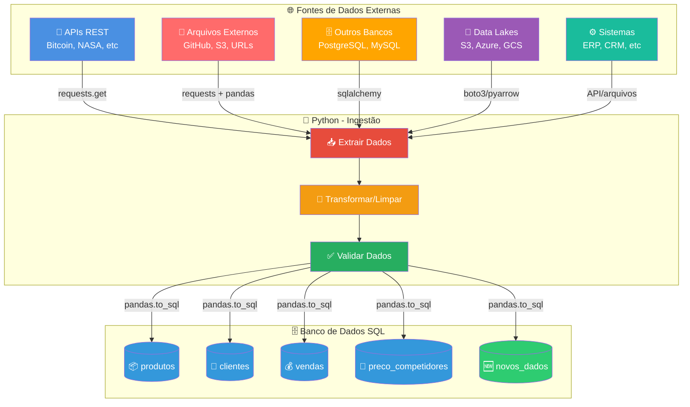

# 🐍 Dia 2: Python & Ingestão de Dados | Jornada de Dados

Bem-vindo ao **segundo dia da imersão Jornada de Dados**! Hoje você vai aprender Python para trabalhar com dados, focando em **ingestão** - o processo de coletar dados de diferentes fontes e prepará-los para análise.

---

## 📖 O que é Python para Dados?

**Python** é uma linguagem de programação versátil e poderosa que se tornou o padrão da indústria para trabalhar com dados. É a ferramenta que permite:

- ✅ **Ingerir dados** - Coletar dados de APIs, arquivos externos, bancos de dados, Data Lakes
- ✅ **Processar dados** - Limpar, transformar e preparar dados para análise
- ✅ **Analisar dados** - Fazer análises estatísticas e exploratórias
- ✅ **Automatizar tarefas** - Criar scripts que fazem o trabalho pesado

**Python não é apenas uma linguagem de programação.** É um ecossistema completo com bibliotecas especializadas para cada necessidade de dados.

---

## 🔄 Processo de Ingestão de Dados

**Ontem (Dia 1 - SQL):** Trabalhamos com dados que **já existiam** no banco de dados (4 tabelas: produtos, clientes, vendas, preco_competidores).

**Hoje (Dia 2 - Python):** Vamos **trazer novos dados** para o banco através do Python, coletando dados de diferentes fontes externas.

### 📊 Fluxo de Ingestão de Dados

O diagrama abaixo mostra como Python atua como **ponte** entre diferentes fontes de dados e o banco SQL:



### 🎯 Exemplo Prático: Integração de Dados Externos

**Caso de Negócio:** Coletar dados de produtos e preços de arquivos públicos (GitHub, S3) para análise competitiva.

**Fluxo:**
1. 📁 **Arquivos Externos** → Python baixa dados de repositórios públicos (Parquet, CSV)
2. 🔄 **Transformação** → Limpa e padroniza dados
3. ✅ **Validação** → Verifica qualidade dos dados
4. 🗄️ **Carga** → Salva na tabela `preco_competidores` do banco SQL
5. 📊 **Análise** → SQL compara nossos preços com concorrentes

**Resultado:** Dados atualizados de concorrentes prontos para análise no banco SQL!

### 📚 Principais Bibliotecas Python para Dados

| Biblioteca | Logo | Descrição | GitHub |
|------------|------|-----------|--------|
| **Pandas** | 🐼 | Manipulação e análise de dados tabulares | [pandas-dev/pandas](https://github.com/pandas-dev/pandas) |
| **PySpark** | ⚡ | Processamento distribuído de Big Data | [apache/spark](https://github.com/apache/spark) |
| **Airflow** | ✈️ | Orquestração e agendamento de pipelines | [apache/airflow](https://github.com/apache/airflow) |
| **Streamlit** | 🎈 | Criação rápida de dashboards e apps web | [streamlit/streamlit](https://github.com/streamlit/streamlit) |
| **NumPy** | 🔢 | Computação numérica e arrays multidimensionais | [numpy/numpy](https://github.com/numpy/numpy) |
| **Scikit-learn** | 🤖 | Machine Learning e análise de dados | [scikit-learn/scikit-learn](https://github.com/scikit-learn/scikit-learn) |
| **Matplotlib** | 📊 | Visualização de dados e gráficos | [matplotlib/matplotlib](https://github.com/matplotlib/matplotlib) |
| **Requests** | 🌐 | Requisições HTTP e consumo de APIs | [psf/requests](https://github.com/psf/requests) |
| **PyArrow** | 🏹 | Leitura/escrita de Parquet e formatos colunares | [apache/arrow](https://github.com/apache/arrow) |
| **SQLAlchemy** | 🗄️ | ORM e acesso a bancos de dados | [sqlalchemy/sqlalchemy](https://github.com/sqlalchemy/sqlalchemy) |

**Cada biblioteca resolve um problema específico:**
- 🐼 **Pandas**: Trabalhar com dados tabulares (CSV, Excel, SQL)
- ⚡ **PySpark**: Processar grandes volumes de dados distribuídos
- ✈️ **Airflow**: Orquestrar e agendar pipelines de dados
- 🎈 **Streamlit**: Criar dashboards interativos rapidamente
- 🔢 **NumPy**: Operações matemáticas e arrays eficientes
- 🤖 **Scikit-learn**: Machine Learning e modelos preditivos
- 📊 **Matplotlib**: Visualizar dados com gráficos
- 🌐 **Requests**: Consumir APIs e fazer requisições HTTP
- 🏹 **PyArrow**: Trabalhar com arquivos Parquet (formato otimizado para Big Data)
- 🗄️ **SQLAlchemy**: Conectar e trabalhar com bancos de dados

**Exemplo:**
```python
# Você diz: "Quero ler dados de vendas e calcular receita total"
import pandas as pd

df = pd.read_csv("vendas.csv")
df['receita'] = df['quantidade'] * df['preco_unitario']
receita_total = df['receita'].sum()

print(f"Receita total: R$ {receita_total:,.2f}")
```

---

## 💼 Mercado de Python para Dados

Python é a linguagem mais usada no mercado de dados e ciência de dados:

### 📊 Por que Python é importante?

1. **Ecossistema rico**: Pandas, NumPy, Scikit-learn, TensorFlow, PyTorch
2. **Demanda de mercado**: Habilidade essencial em 90% das vagas de dados
3. **Versatilidade**: Serve para análise, engenharia, machine learning, automação
4. **Comunidade**: Grande comunidade, muitos recursos e bibliotecas open-source
5. **Integração**: Fácil integração com bancos de dados, APIs, sistemas

### 🎯 Onde Python é usado?

- **Data Engineering**: Pipelines de dados, ETL, ingestão
- **Data Analysis**: Análise exploratória, relatórios automatizados
- **Data Science**: Machine Learning, estatística, modelagem
- **Automação**: Scripts para tarefas repetitivas
- **APIs e Integrações**: Conectar diferentes sistemas

### 💰 Salários no Brasil (2024)

- **Analista de Dados Júnior**: R$ 3.000 - R$ 6.000
- **Analista de Dados Pleno**: R$ 6.000 - R$ 10.000
- **Analista de Dados Sênior**: R$ 10.000 - R$ 18.000
- **Cientista de Dados**: R$ 8.000 - R$ 20.000+
- **Engenheiro de Dados**: R$ 10.000 - R$ 25.000+

**Python é a base de todas essas carreiras.**

**Pesquisa de Vagas:**
- 🔍 [LinkedIn: Python & SQL no Brasil](https://www.linkedin.com/jobs/search/?currentJobId=4350781561&geoId=106057199&keywords=python%20%26%20sql&origin=JOB_SEARCH_PAGE_SEARCH_BUTTON&refresh=true) - **13.000+ vagas disponíveis**

**Fonte:** Glassdoor, LinkedIn, pesquisas de mercado 2024

---

## 🎯 Foco do Curso

Neste **Dia 2**, vamos focar em:

✅ **Ingestão de Dados** - 70% do tempo  
✅ **Tratamento Básico** - 20% do tempo  
✅ **Exportação** - 10% do tempo  

**Por quê?** Engenheiros e analistas de dados passam a maior parte do tempo coletando e preparando dados. Você vai aprender a **pensar como engenheiro de dados** e **integrar diferentes fontes de dados**.

---

## 🔄 SQL vs Python: Qual a Diferença?

### 📊 SQL (Dia 1)
**Trabalha com dados que JÁ EXISTEM no banco de dados**

- ✅ Dados já estão armazenados
- ✅ Foco em consultar e analisar
- ✅ Linguagem declarativa (diz o que quer)
- ✅ Otimizado para grandes volumes
- ✅ Ideal para análises e relatórios

**Exemplo:**
```sql
-- Os dados JÁ ESTÃO no banco
SELECT * FROM vendas WHERE data_venda > '2024-01-01';
```

### 🐍 Python (Dia 2)
**BUSCA dados de sistemas externos e integra diferentes fontes**

- ✅ Dados vêm de sistemas externos (APIs, arquivos externos, Data Lakes)
- ✅ Foco em coletar e integrar
- ✅ Linguagem imperativa (diz como fazer)
- ✅ Ideal para automação e integração
- ✅ Conecta diferentes sistemas

**Exemplo:**
```python
# BUSCA dados de uma API externa
import requests
dados = requests.get("https://api.coinbase.com/v2/prices/spot").json()
```

### 🎯 Resumo

| Aspecto | SQL | Python |
|---------|-----|--------|
| **Dados** | Já existem no banco | Busca de sistemas externos |
| **Foco** | Consultar e analisar | Coletar e integrar |
| **Uso** | Análises e relatórios | APIs, scraping, automação |
| **Quando usar** | Dados já armazenados | Dados externos, integração |

**Python na engenharia de dados = COMUNICAR e INTEGRAR sistemas externos!**

---

## 🎯 Perguntas de Negócio que Vamos Responder

Este **Dia 2** foi criado para resolver problemas reais de ingestão de dados. Abaixo estão todas as perguntas que vamos responder com os exemplos:

### 🔥 Exemplo 00: Aquecimento Python
1. **Por que preciso saber Python básico para trabalhar com dados?**
   - Variáveis, listas, dicionários - fundamentos essenciais
   - Como estruturas de dados se relacionam com dados reais
   - Por que isso é a base para trabalhar com APIs e arquivos

### 💾 Exemplo 01: Conectar com DataLake
2. **Como ler dados de um Data Lake usando a API S3?**
   - O que é um Data Lake e por que é importante
   - Como usar boto3 para conectar com S3/Supabase Storage
   - Como ler arquivos Parquet de Data Lakes
   - Por que AWS S3 é o padrão da indústria

### 🗄️ Exemplo 02: Salvar no Banco de Dados
3. **Como salvar dados processados em um banco PostgreSQL?**
   - Como conectar Python com PostgreSQL usando SQLAlchemy
   - Como salvar DataFrame em tabela SQL
   - Por que pandas serve para ler, processar E salvar dados

### 🎯 Exemplo 03: Projeto Completo
4. **Como fazer um pipeline completo: DataLake → Banco?**
   - Como combinar todos os conceitos aprendidos
   - Pipeline completo: ler do DataLake e salvar no banco
   - Fluxo EL (Extract, Load) sem processamento

### 🌐 Exemplo 04: Ler API Bitcoin
5. **Como obter dados de uma API e salvar no banco de dados?**
   - O que é uma API e por que usar
   - Como usar a biblioteca requests
   - Como fazer requisições GET para APIs REST
   - Pipeline completo: API → Processamento → Banco

---

## 🔥 Bloco 1: Aquecimento Python (20min)

Antes de trabalhar com dados, é essencial dominar os fundamentos de Python. Este bloco garante que você tenha a base necessária.

**Conceito:** Fundamentos de Python  
**Pergunta de Negócio:** Por que preciso saber Python básico para trabalhar com dados?  

**O que você aprende:**
- Print e Hello World
- Variáveis e tipos básicos (str, int)
- Estruturas de dados (lista, dicionário)
- Por que isso é importante para trabalhar com dados
- Como estruturas de dados se relacionam com dados reais (exemplo: tênis)

**Conceitos Python:**
- `print()`: exibir informações
- Variáveis: `str`, `int`
- Listas: `[]` - coleção ordenada de itens
- Dicionários: `{}` - pares chave-valor (estrutura mais comum para dados tabulares)
- Lista de dicionários: estrutura ideal para dados estruturados

**Por que é importante?**
- APIs retornam dados em JSON (que são dicionários em Python)
- Arquivos externos precisam ser baixados e processados
- Pandas usa esses conceitos por baixo dos panos
- Dicionários são a base para trabalhar com dados estruturados

**Resultado Esperado:**
- Compreensão dos fundamentos de Python
- Capacidade de trabalhar com listas e dicionários
- Entendimento de como estruturas de dados se relacionam com dados reais

---

### 💾 Exemplo 01: Conectar com DataLake

#### `exemplo-01-ler-datalake-parquet.py`

---

## 🎯 Progressão de Aprendizado

A aula está organizada em **5 exemplos práticos** que cobrem todo o fluxo de ingestão de dados:

1. **🔥 Exemplo 00: Aquecimento Python** - Fundamentos essenciais
2. **💾 Exemplo 01: Conectar com DataLake** - Trabalhar com armazenamento em nuvem
3. **🗄️ Exemplo 02: Salvar no Banco de Dados** - Persistir dados processados
4. **🎯 Exemplo 03: Projeto Completo** - Pipeline DataLake → Banco
5. **🌐 Exemplo 04: Ler API Bitcoin** - Integrar dados externos via API

---

## 📚 Detalhamento dos Exemplos

### 🔥 Exemplo 00: Aquecimento Python

#### `exemplo-00-aquecimento-fundamentos.py`
**Conceito:** Conectar com DataLake (S3/Supabase Storage) e ler Parquet  
**Pergunta de Negócio:** Como ler dados de um Data Lake usando a API S3?  

**O que você aprende:**
- Como instalar e importar boto3
- Como criar um cliente S3 para conectar com DataLake
- Como listar arquivos no bucket
- Como baixar arquivos Parquet de Data Lakes
- Como converter Parquet para DataFrame
- Análises básicas com Pandas (head, info, describe, groupby, etc.)
- Por que AWS S3 é o padrão da indústria (mais de 50% das empresas usam)
- Por que Parquet é ideal para Data Lakes

**Conceitos Python:**
- `import boto3`: biblioteca para trabalhar com S3
- `boto3.client()`: cria cliente S3 (compatível com Supabase Storage)
- `s3.list_objects()`: lista arquivos no bucket
- `s3.get_object()`: baixa arquivo do Data Lake
- `pd.read_parquet(io.BytesIO())`: lê Parquet da memória
- Métodos Pandas: `head()`, `info()`, `describe()`, `value_counts()`, `groupby()`, `nlargest()`, etc.

**Por que Data Lakes são importantes?**
- Armazenam grandes volumes de dados (terabytes/petabytes)
- Mantêm dados em formato original (sem transformação prévia)
- Suportam múltiplos formatos (CSV, Parquet, JSON)
- Escalabilidade horizontal (cresce conforme necessidade)
- Economia de custos (armazenamento barato)

**AWS S3 é o padrão da indústria:**
- Mais de 50% das empresas usam AWS S3 para Data Lakes
- API padrão que funciona com múltiplas ferramentas
- Compatível com Supabase Storage, MinIO, e outros

**Resultado Esperado:**
- Conexão estabelecida com Data Lake
- Arquivo Parquet baixado e carregado com sucesso
- Dados convertidos para DataFrame e analisados com Pandas
- Compreensão da importância de Data Lakes na indústria

---

### 🗄️ Exemplo 02: Salvar no Banco de Dados

#### `exemplo-02-salvar-banco-dados.py`
**Conceito:** Salvar dados processados no PostgreSQL usando pandas  
**Pergunta de Negócio:** Como salvar dados processados em um banco PostgreSQL?  

**O que você aprende:**
- Como conectar com PostgreSQL usando SQLAlchemy
- Como salvar DataFrame em tabela SQL com `df.to_sql()`
- Como ler dados salvos para verificar
- Como executar queries SQL e trazer para pandas
- Como atualizar tabela existente (append)
- Por que pandas serve para ler, processar E salvar dados

**Conceitos Python:**
- `sqlalchemy.create_engine()`: cria engine para PostgreSQL
- `df.to_sql()`: salva DataFrame em tabela SQL
- `pd.read_sql_query()`: executa SQL e retorna DataFrame
- `if_exists`: 'replace' (substitui), 'append' (adiciona), 'fail' (erro)

**Por que salvar no banco?**
- Dados podem ser consultados com SQL
- Integração com outras ferramentas (BI, dashboards)
- Dados persistentes e seguros
- Permite queries complexas

**Resultado Esperado:**
- Dados salvos no PostgreSQL com sucesso
- Tabela criada e populada
- Dados verificados através de query SQL
- Compreensão de como Python integra com bancos de dados

---

### 🎯 Exemplo 03: Projeto Completo

#### `exemplo-03-projeto-completo.py`
**Conceito:** Buscar dados de API e salvar no PostgreSQL  
**Pergunta de Negócio:** Como obter dados de uma API e salvar no banco de dados?  
**O que você aprende:**
- O que é uma API e por que usar
- Como usar a biblioteca requests
- Como fazer requisições GET para APIs REST
- Como processar dados JSON
- Como salvar dados de API no PostgreSQL
- Pipeline completo: API → Processamento → Banco

**Conceitos Python:**
- `requests.get()`: faz requisição HTTP GET para API
- `response.json()`: converte resposta JSON para dicionário Python
- `response.raise_for_status()`: verifica erros HTTP
- `pd.DataFrame()`: cria DataFrame a partir de dicionário
- `df.to_sql()`: salva DataFrame no PostgreSQL

**O que é uma API?**
- API (Application Programming Interface) = Interface de Programação de Aplicações
- Forma de COMUNICAR com outros sistemas através da internet
- Python na Engenharia de Dados = COMUNICAR com sistemas externos
- SQL trabalha com dados que JÁ EXISTEM no banco
- Python BUSCA dados de sistemas externos via APIs

**Biblioteca Requests:**
- A forma mais simples de fazer requisições HTTP em Python
- Permite: GET (buscar), POST (enviar), PUT (atualizar), DELETE (deletar)
- Para engenharia de dados, usamos principalmente GET para buscar dados

**Fluxo Completo:**
1. **Extract**: Buscar dados da API do Bitcoin (Coinbase)
2. **Transform**: Processar dados JSON e enriquecer (adicionar timestamp, calcular BRL)
3. **Load**: Salvar dados processados no PostgreSQL

**Resultado Esperado:**
- Dados obtidos da API do Bitcoin com sucesso
- Dados processados e transformados
- Dados salvos na tabela `cotacao_bitcoin` no PostgreSQL
- Pipeline API → Banco funcionando

---


---

## 🎓 Como Usar

### 1. Instalar Dependências

```bash
# Criar ambiente virtual (recomendado)
python -m venv venv

# Ativar ambiente virtual
# No Windows:
venv\Scripts\activate
# No Mac/Linux:
source venv/bin/activate

# Instalar dependências
pip install -r requirements.txt
```

### 2. Executar Exemplos

```bash
# Navegar para diretório de exemplos
cd aulas/aula-02-python/exemplos

# 🔥 EXEMPLO 00: Aquecimento Python
python exemplo-00-aquecimento-fundamentos.py

# 💾 EXEMPLO 01: Conectar com DataLake
python exemplo-01-ler-datalake-parquet.py

# 🗄️ EXEMPLO 02: Salvar no Banco de Dados
python exemplo-02-salvar-banco-dados.py

# 🎯 EXEMPLO 03: Projeto Completo (DataLake → Banco)
python exemplo-03-projeto-completo.py

# 🌐 EXEMPLO 04: Ler API Bitcoin
python exemplo-04-ler-api-bitcoin.py
```

### 3. Modificar e Experimentar

- Altere os caminhos dos arquivos
- Teste com seus próprios dados
- Combine conceitos de diferentes exemplos
- Crie seus próprios scripts

---

## 📝 Checklist de Aprendizado

Após fazer todos os exemplos, você deve ser capaz de:

### 🔥 Exemplo 00: Aquecimento Python
- [ ] Usar print e f-strings
- [ ] Trabalhar com variáveis (str, int)
- [ ] Usar listas e dicionários
- [ ] Entender por que dicionários são essenciais para dados estruturados
- [ ] Trabalhar com lista de dicionários

### 💾 Exemplo 01: Conectar com DataLake
- [ ] Entender o que é um Data Lake
- [ ] Usar boto3 para conectar com S3/Supabase Storage
- [ ] Listar arquivos no bucket
- [ ] Baixar arquivos Parquet de Data Lakes
- [ ] Ler Parquet e converter para DataFrame
- [ ] Fazer análises básicas com Pandas
- [ ] Compreender a importância de Data Lakes na indústria

### 🗄️ Exemplo 02: Salvar no Banco de Dados
- [ ] Conectar Python com PostgreSQL usando SQLAlchemy
- [ ] Salvar DataFrames em tabelas SQL
- [ ] Executar queries SQL e trazer para pandas
- [ ] Atualizar tabelas existentes (append)

### 🎯 Exemplo 03: Projeto Completo
- [ ] Combinar boto3 + pandas + sqlalchemy
- [ ] Criar pipeline completo DataLake → Banco
- [ ] Entender fluxo EL (Extract, Load)

### 🌐 Exemplo 04: Ler API Bitcoin
- [ ] Entender o que é uma API
- [ ] Usar biblioteca requests para fazer requisições HTTP
- [ ] Processar dados JSON de APIs
- [ ] Criar pipeline completo API → Processamento → Banco

---

## 💡 Dicas

- **Execute em ordem:** Cada exemplo introduz um conceito novo
- **Modifique:** Tente adaptar os scripts para seus próprios dados
- **Combine:** Use conceitos de exemplos anteriores em novos contextos
- **Valide:** Sempre verifique se os dados foram carregados corretamente
- **Pratique:** Crie seus próprios scripts de ingestão

---

## 🐛 Troubleshooting

### Erro: "ModuleNotFoundError: No module named 'pandas'"
```bash
pip install pandas
```

### Erro: "FileNotFoundError: vendas.csv"
- Verifique se os arquivos CSV estão na pasta `data/`
- Verifique o caminho relativo no script

### Erro: "ConnectionError" ao baixar arquivos externos
- Verifique sua conexão com internet
- Verifique se a URL do arquivo está correta e acessível
- Alguns repositórios podem ter rate limiting - adicione delays entre requisições

### Erro: "sqlite3.OperationalError: no such table"
- Execute primeiro o exemplo que cria o banco
- Verifique se o banco foi criado corretamente

---

## 🎯 Próximos Passos

Depois de dominar todos os exemplos:

1. Pratique criando seus próprios scripts de ingestão
2. Combine diferentes fontes de dados
3. Automatize processos de coleta de dados
4. Avance para a **Aula 3: Engenharia de Dados**

---

## 📊 Resumo dos Conceitos por Exemplo

| Exemplo | Conceito Principal | O que você aprende |
|---------|-------------------|-------------------|
| 🔥 00 | Fundamentos Python | Variáveis, listas, dicionários - base para trabalhar com dados |
| 💾 01 | DataLake (S3/Supabase) | Conectar com Data Lakes, ler Parquet, análises com Pandas |
| 🗄️ 02 | Salvar no PostgreSQL | Conectar Python com banco, salvar DataFrames, queries SQL |
| 🎯 03 | Projeto Completo | Pipeline completo: DataLake → Banco (EL) |
| 🌐 04 | API Bitcoin → Banco | Consumir APIs REST, processar JSON, salvar no banco |

**Total: 5 exemplos práticos cobrindo todo o fluxo de ingestão de dados!** 🚀

---

## 🔗 Recursos Adicionais

- [Documentação Pandas](https://pandas.pydata.org/docs/)
- [Documentação Requests](https://requests.readthedocs.io/)
- [Documentação PyArrow (Parquet)](https://arrow.apache.org/docs/python/)
- [SQLAlchemy Tutorial](https://docs.sqlalchemy.org/en/20/tutorial/)

---

**Boa jornada! 🐍**

