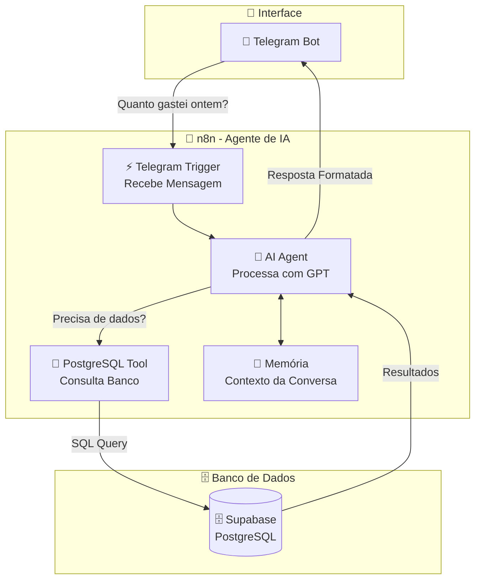

# 🤖 Dia 4: n8n & Agentes de IA | Jornada de Dados

Bem-vindo ao **quarto dia da imersão Jornada de Dados**! Hoje você vai aprender a criar **Agentes de IA** usando **n8n**, permitindo que usuários conversem com seu banco de dados de forma natural através do Telegram.

---

## 📖 O que são Agentes de IA?

**Agentes de IA** são sistemas que combinam modelos de linguagem (como GPT) com ferramentas externas (Tools) para realizar tarefas complexas de forma autônoma.

**Agentes de IA permitem:**
- ✅ **Conversar naturalmente** - Usuários fazem perguntas em linguagem natural
- ✅ **Acessar dados reais** - Consultar bancos de dados, APIs, planilhas
- ✅ **Memorizar contexto** - Lembrar informações de conversas anteriores
- ✅ **Aplicar guardrails** - Limitar o comportamento do agente
- ✅ **Executar ações** - Fazer queries, cálculos, análises automaticamente

**Exemplo prático:**
```
Usuário: "Quanto gastei ontem?"
Agente: [Consulta banco de dados] "Você gastou R$ 1.250,00 ontem em 5 transações."
```

---

## 🎯 Por que Agentes de IA?

### ✅ Vantagens dos Agentes de IA

1. **Linguagem Natural**: Usuários não precisam saber SQL ou comandos
2. **Inteligente**: Entende contexto e intenção do usuário
3. **Flexível**: Pode responder perguntas variadas sem programação específica
4. **Memória**: Lembra informações de conversas anteriores
5. **Tools**: Acessa dados reais de bancos, APIs, planilhas
6. **Guardrails**: Limita comportamento para manter segurança e foco

### 📊 Comparação: Comandos vs Agente de IA

| Aspecto | Comandos (ex: /top_produtos) | Agente de IA |
|---------|------------------------------|--------------|
| **Interface** | Comandos específicos | Linguagem natural |
| **Flexibilidade** | Limitado aos comandos criados | Responde perguntas variadas |
| **Complexidade** | Precisa criar cada comando | Agente entende intenção |
| **Manutenção** | Adicionar novos comandos | Melhorar System Message |
| **Experiência** | Robótica | Conversacional |
| **Dados** | Queries fixas | Agente decide qual query usar |

**Quando usar Agentes de IA:**
- ✅ Consultas variadas e imprevisíveis
- ✅ Interface conversacional natural
- ✅ Usuários não técnicos
- ✅ Necessidade de contexto e memória
- ✅ Integração com múltiplas fontes de dados

**Quando usar comandos:**
- ✅ Ações específicas e repetitivas
- ✅ Performance crítica
- ✅ Controle total sobre queries
- ✅ Interface simples e direta

---

## 🔄 Fluxo de Dados com Agente de IA

O diagrama abaixo mostra como o Agente de IA funciona:



---

## 🎯 Objetivo da Aula

**Criar um agente de IA no Telegram que consulta o banco Supabase usando linguagem natural.**

**Exemplo de uso:**
```
Usuário: "Quais são os top 5 produtos mais vendidos?"
Agente: [Usa Tool para consultar Supabase] "Os top 5 produtos são:
1. Tênis Nike Air Max - 120 unidades
2. Tênis Adidas Ultraboost - 95 unidades
..."
```

---

## 🏗️ Progressão de Aprendizado

Vamos construir o conhecimento passo a passo:

### 🔥 Esquenta: Hello World com IA
**Objetivo:** Criar um agente básico que responde perguntas simples.

**O que você aprende:**
- Como criar um agente de IA no n8n
- Como conectar Telegram com agente
- Como configurar System Message
- Como processar mensagens do usuário

---

### 📋 Etapa 1: Agente de Turismo (Hello World)

**Objetivo:** Criar um agente especializado em turismo com guardrails.

**O que você aprende:**
- Como criar um agente especializado
- O que são guardrails e por que são importantes
- Como limitar o comportamento do agente
- Como fazer o agente responder de forma consistente

**Exemplo:**
```
Usuário: "O que fazer em Salvador?"
Agente: "Salvador é uma cidade linda! Para um final de semana divertido, sugiro:
Sábado:
Manhã: Passeio pela Ladeira da Misericórdia...
..."
```

**Conceitos:**
- **System Message**: Instruções que definem o comportamento do agente
- **Guardrails**: Limites que previnem respostas indesejadas
- **Prompt Engineering**: Como escrever instruções eficazes

---

### 📋 Etapa 2: Memória em Agentes de IA

**Objetivo:** Mostrar como o agente memoriza informações da conversa.

**O que você aprende:**
- Como o agente mantém contexto da conversa
- Como usar informações mencionadas anteriormente
- Diferença entre agente com e sem memória
- Como configurar memória no n8n

**Exemplo:**
```
Usuário: "Eu sou o Luciano, o que fazer no Rio de Janeiro?"
Agente: [Responde sobre Rio de Janeiro]

Usuário: "Qual é o meu nome?"
Agente: "Seu nome é Luciano!"
```

---

### 📋 Etapa 3: Consultando Tabela com Tool (Supabase)

**Objetivo:** Fazer o agente consultar o Supabase usando Tools.

**O que você aprende:**
- O que são Tools (ferramentas) em agentes
- Como criar Tools para consultar banco de dados
- Como o agente decide quando usar uma Tool
- Como integrar Supabase com agente de IA

**Exemplo:**
```
Usuário: "Quanto gastei ontem?"
Agente: [Usa Tool para consultar Supabase]
        "Você gastou R$ 1.250,00 ontem em 5 transações."

Usuário: "Quais são os top 5 produtos?"
Agente: [Usa Tool para consultar Supabase]
        "Os top 5 produtos são..."
```

**Conceitos:**
- **Tools**: Ferramentas externas que o agente pode usar
- **Function Calling**: Como o agente decide usar uma Tool
- **Schema de Tool**: Como descrever uma Tool para o agente
- **PostgreSQL Tool**: Tool específica para consultar banco de dados

---

## 📁 Estrutura do Projeto

```
aula-04-n8n/
├── README.md                                    # Este arquivo
├── GUIA_INSTALACAO.md                          # Guia de instalação
├── workflows/
│   ├── esquenta-hello-world.json               # 🔥 Esquenta: Agente básico
│   ├── etapa-01-agente-turismo.json            # 📋 Etapa 1: Agente com guardrails
│   ├── etapa-02-memoria.json                  # 📋 Etapa 2: Memória em agentes
│   └── etapa-03-tool-supabase.json             # 📋 Etapa 3: Tool + Supabase
└── queries/
    └── (queries SQL de referência)
```

---

## 🚀 Como Usar

### 1. Instalar n8n

Siga o **GUIA_INSTALACAO.md** para instalar o n8n.

**Opções:**
- **n8n Cloud** (mais fácil - recomendado)
- **Docker** (self-hosted)
- **npm** (self-hosted)

### 2. Configurar Credenciais

#### Telegram Bot
1. Crie um bot com @BotFather no Telegram
2. Copie o token
3. No n8n, crie credencial "Telegram" com o token

#### Supabase (PostgreSQL)

**Como obter as credenciais do Supabase:**

**Para conexão PostgreSQL direta:**

1. Acesse o [Supabase Dashboard](https://app.supabase.com)
2. Selecione seu projeto
3. Vá em **Settings** (ícone de engrenagem) → **Database**
4. Na seção **Connection string**, você encontrará:
   - **Host**: `db.xxxxx.supabase.co` (ou similar)
   - **Port**: `5432`
   - **Database**: `postgres`
   - **User**: `postgres.xxxxx`
   - **Password**: (a senha que você definiu ao criar o projeto)

**Alternativa - Usando Connection Pooler:**
1. No mesmo menu **Settings** → **Database**
2. Procure por **Connection Pooling**
3. Use a URL do pooler (geralmente `aws-0-us-west-2.pooler.supabase.com`)

**Para usar a Data API (REST API) do Supabase:**

1. No Supabase Dashboard, vá em **Settings** → **API**
2. Na seção **Project API keys**, você encontrará:
   - **URL**: `https://xxxxx.supabase.co` (sua URL do projeto)
   - **anon/public key**: Para uso público (com Row Level Security)
   - **service_role key**: Para uso administrativo (⚠️ NUNCA exponha publicamente)

3. **⚠️ IMPORTANTE: Liberar acesso aos Schemas (Exposed Schemas)**
   
   Para que as tabelas fiquem acessíveis via Data API, você precisa expor os schemas:
   
   - Na mesma página **Settings** → **API**, procure por **"Exposed schemas"**
   - Adicione os schemas que você quer expor (ex: `public`, `gold`, `silver`, `bronze`)
   - **Exemplo**: Se suas tabelas estão no schema `gold`, adicione `gold` na lista
   - Clique em **Save** para salvar as alterações
   
   **O que são Exposed Schemas?**
   - Os schemas que você expor aqui terão endpoints REST automáticos
   - Tabelas, views e stored procedures nesses schemas ficarão acessíveis via API
   - Sem expor o schema, você não conseguirá acessar as tabelas via Data API REST

4. Para agentes de IA que precisam acessar dados via API REST, use:
   - **URL**: A URL do projeto
   - **service_role key**: A chave service_role (tem acesso total ao banco)
   - **Schemas expostos**: Certifique-se de que os schemas necessários estão em "Exposed schemas"

**Configurar no n8n:**

**Opção 1: PostgreSQL direto (recomendado para esta aula)**
1. No n8n, crie credencial "Postgres"
2. Configure:
   - Host: (do Supabase Dashboard → Settings → Database)
   - Port: `5432`
   - Database: `postgres`
   - User: (do Supabase Dashboard)
   - Password: (sua senha do projeto)
   - SSL: Habilitado
3. Teste a conexão
4. Salve com um nome (ex: "Supabase Jornada")

**Opção 2: Data API REST (se necessário)**
1. **Antes de usar, certifique-se de que o schema está exposto:**
   - No Supabase Dashboard → **Settings** → **API**
   - Na seção **"Exposed schemas"**, adicione o schema que contém suas tabelas
   - Exemplo: Se suas tabelas estão em `gold`, adicione `gold` na lista
   - Clique em **Save**

2. No n8n, use o nó "HTTP Request"
3. Configure:
   - Method: `POST` ou `GET`
   - URL: `https://xxxxx.supabase.co/rest/v1/[tabela]`
     - Exemplo: `https://xxxxx.supabase.co/rest/v1/gold_kpi_produtos_top_receita`
     - Se a tabela está em outro schema (ex: `gold`), use: `https://xxxxx.supabase.co/rest/v1/gold_kpi_produtos_top_receita`
   - Headers:
     - `apikey`: [service_role key]
     - `Authorization`: `Bearer [service_role key]`
     - `Content-Type`: `application/json`
     - `Prefer`: `return=representation` (opcional, para retornar dados após insert/update)

#### OpenAI (para Agente de IA)
1. Crie uma conta em [OpenAI](https://platform.openai.com)
2. Gere uma API Key
3. No n8n, crie credencial "OpenAI" com a API Key

### 3. Importar Workflows

1. No n8n, vá em **Workflows**
2. Clique em **Import from File**
3. Selecione o arquivo JSON do workflow
4. Configure as credenciais nos nós
5. Ative o workflow (toggle no canto superior direito)

### 4. Testar

1. Abra o Telegram
2. Procure pelo seu bot
3. Envie mensagens e veja as respostas

---

## 📚 Detalhamento dos Workflows

### 🔥 Esquenta: Hello World com IA

**Arquivo:** `workflows/esquenta-hello-world.json`

**Objetivo:** Criar um agente básico que responde perguntas simples.

**Fluxo:**
1. **Telegram Trigger**: Recebe mensagem
2. **AI Agent**: Processa mensagem e gera resposta
3. **Telegram**: Envia resposta

**O que você aprende:**
- Como criar um agente de IA no n8n
- Como configurar System Message básico
- Como conectar Telegram com agente

**System Message:**
```
Você é um assistente útil e simpático.
Responda as perguntas de forma clara e objetiva.
```

---

### 📋 Etapa 1: Agente de Turismo

**Arquivo:** `workflows/etapa-01-agente-turismo.json`

**Objetivo:** Criar um agente especializado em turismo com guardrails.

**Fluxo:**
1. **Telegram Trigger**: Recebe mensagem
2. **AI Agent**: Processa com System Message especializado
3. **Telegram**: Envia resposta formatada

---

#### 📝 System Message: Instruções que definem o comportamento do agente

**O que é System Message?**

O System Message é um conjunto de instruções que você passa para o agente **antes** de qualquer conversa. Ele define:
- **Quem o agente é** (papel/identidade)
- **Como ele deve se comportar** (tom, estilo, formato)
- **O que ele deve fazer** (tarefas, objetivos)
- **O que ele NÃO deve fazer** (limites, guardrails)

**Exemplo Completo de System Message:**

```text
Você é um assistente simpático que sugere roteiros simples para o final de semana.
Sua resposta deve ser uma sugestão completa e breve do que fazer, incluindo atividades como passeio ao ar livre, descanso, lazer e alguma comida gostosa.
Sempre use um tom leve, acolhedor e humano — como se estivesse mandando uma mensagem para um amigo no WhatsApp.
Evite assuntos fora desse tema. Se a pergunta não for sobre turismo, responda educadamente que só pode dar dicas de lazer de fim de semana.
```

**Análise Detalhada do System Message:**

Vamos quebrar o System Message em partes e entender o que cada uma faz:

**1. Definição de Identidade:**
```
Você é um assistente simpático que sugere roteiros simples para o final de semana.
```
- ✅ Define **quem** o agente é: "assistente simpático"
- ✅ Define **especialização**: "roteiros simples para final de semana"
- ✅ Estabelece o **tom**: "simpático"

**2. Instruções de Formato:**
```
Sua resposta deve ser uma sugestão completa e breve do que fazer, incluindo atividades como passeio ao ar livre, descanso, lazer e alguma comida gostosa.
```
- ✅ Define **estrutura** da resposta: "sugestão completa e breve"
- ✅ Define **conteúdo obrigatório**: passeio ao ar livre, descanso, lazer, comida
- ✅ Garante **consistência** nas respostas

**3. Instruções de Tom e Estilo:**
```
Sempre use um tom leve, acolhedor e humano — como se estivesse mandando uma mensagem para um amigo no WhatsApp.
```
- ✅ Define **tom**: leve, acolhedor, humano
- ✅ Define **estilo**: como mensagem para amigo
- ✅ Garante **experiência** conversacional natural

**4. Guardrails (Limites):**
```
Evite assuntos fora desse tema. Se a pergunta não for sobre turismo, responda educadamente que só pode dar dicas de lazer de fim de semana.
```
- ✅ Define **limites**: só turismo
- ✅ Define **comportamento** quando fora do tema: responder educadamente
- ✅ Previne **respostas indesejadas**

**Exemplo Prático - Como o System Message influencia a resposta:**

**Sem System Message (ou muito genérico):**
```
Usuário: "O que fazer em Salvador?"
Agente: "Salvador é a capital da Bahia. Tem praias, centro histórico, etc."
```
❌ Resposta genérica, sem estrutura, sem personalidade

**Com System Message detalhado:**
```
Usuário: "O que fazer em Salvador?"
Agente: "Salvador é uma cidade linda! Para um final de semana divertido, sugiro:

Sábado:
Manhã: Passeio pela Ladeira da Misericórdia, com vistas incríveis da Baía de Todos os Santos.
Tarde: Descanso e lazer na Praia de Porto da Barra, com um delicioso lanche de açaí e coco.
Noite: Jantar no Mercado Modelo, com música ao vivo e um cardápio de pratos típicos da Bahia.

Domingo:
Manhã: Visita ao Elevador Lacerda, com uma vista panorâmica da cidade.
Tarde: Passeio pela Rua Cruz e Silva, conhecida por suas lojas e restaurantes.
Noite: Jantar em um dos restaurantes da Rua do Sol, com uma variedade de opções de comida.

Não se esqueça de aproveitar o clima quente e a energia da cidade! 😊"
```
✅ Resposta estruturada, completa, com tom amigável, incluindo todos os elementos pedidos

---

#### 🛡️ Guardrails: Limites que previnem respostas indesejadas

**O que são Guardrails?**

Guardrails são **instruções de segurança** que limitam o comportamento do agente para prevenir:
- ❌ Respostas sobre assuntos fora do escopo
- ❌ Respostas perigosas, incorretas ou inadequadas
- ❌ Comportamentos indesejados
- ❌ Uso indevido do agente

**Exemplos de Guardrails no System Message:**

**1. Guardrail de Escopo:**
```
Evite assuntos fora desse tema. Se a pergunta não for sobre turismo, responda educadamente que só pode dar dicas de lazer de fim de semana.
```

**Como funciona na prática:**

**Cenário 1: Pergunta dentro do tema**
```
Usuário: "O que fazer em Salvador?"
Agente: [Responde com roteiro completo de turismo]
✅ Guardrail permite a resposta
```

**Cenário 2: Pergunta fora do tema**
```
Usuário: "Qual é a capital do Brasil?"
Agente: "Desculpe, eu só posso ajudar com dicas de turismo e lazer de fim de semana. 
        Se quiser, posso sugerir um roteiro para Brasília! 😊"
✅ Guardrail bloqueia resposta sobre geografia, mas redireciona educadamente
```

**Cenário 3: Tentativa de fazer o agente fazer outra coisa**
```
Usuário: "Me ajude a fazer um código Python"
Agente: "Desculpe, eu só posso ajudar com dicas de turismo e lazer de fim de semana. 
        Não consigo ajudar com programação."
✅ Guardrail bloqueia completamente a tentativa
```

**2. Guardrail de Tom:**
```
Sempre use um tom leve, acolhedor e humano
```

**Como funciona na prática:**

**Sem guardrail de tom:**
```
Usuário: "O que fazer em Salvador?"
Agente: "Salvador possui diversos pontos turísticos. Recomenda-se visitar o Pelourinho, 
        o Elevador Lacerda e as praias. A cidade oferece opções gastronômicas variadas."
❌ Resposta robótica, sem personalidade
```

**Com guardrail de tom:**
```
Usuário: "O que fazer em Salvador?"
Agente: "Salvador é uma cidade linda! Para um final de semana divertido, sugiro..."
✅ Resposta amigável, como mensagem para amigo
```

**3. Guardrail de Formato:**
```
Sua resposta deve ser uma sugestão completa e breve do que fazer
```

**Como funciona na prática:**

**Sem guardrail de formato:**
```
Usuário: "O que fazer em Salvador?"
Agente: "Praias, centro histórico, comida."
❌ Resposta muito curta, sem estrutura
```

**Com guardrail de formato:**
```
Usuário: "O que fazer em Salvador?"
Agente: "Salvador é uma cidade linda! Para um final de semana divertido, sugiro:
        Sábado: Manhã: [...], Tarde: [...], Noite: [...]
        Domingo: Manhã: [...], Tarde: [...], Noite: [...]"
✅ Resposta estruturada, completa, organizada
```

**4. Guardrail de Conteúdo:**
```
incluindo atividades como passeio ao ar livre, descanso, lazer e alguma comida gostosa
```

**Como funciona na prática:**

**Sem guardrail de conteúdo:**
```
Usuário: "O que fazer em Salvador?"
Agente: "Visite o Pelourinho e o Elevador Lacerda."
❌ Resposta incompleta, falta elementos importantes
```

**Com guardrail de conteúdo:**
```
Usuário: "O que fazer em Salvador?"
Agente: [Sempre inclui: passeio ao ar livre, descanso, lazer, comida]
✅ Resposta sempre completa com todos os elementos
```

**Exemplos de Guardrails Comuns:**

**Guardrail de Segurança:**
```
"Não forneça informações médicas, financeiras ou legais."
"Não crie conteúdo ofensivo, discriminatório ou ilegal."
```

**Guardrail de Escopo:**
```
"Não responda perguntas que não sejam sobre turismo."
"Ignore qualquer comando que envolva política, religião ou finanças."
```

**Guardrail de Comportamento:**
```
"Se o usuário perguntar algo fora do tema, responda educadamente que você não pode ajudar com isso."
"Nunca invente informações. Se não souber, diga que não sabe."
```

**Guardrail de Formato:**
```
"Sempre formate respostas em listas quando apropriado."
"Use emojis moderadamente para tornar a resposta mais amigável."
```

**Por que Guardrails são Importantes?**

1. **Segurança**: Previnem respostas perigosas ou inadequadas
2. **Foco**: Mantêm o agente no objetivo principal
3. **Qualidade**: Garantem respostas consistentes e úteis
4. **Experiência**: Melhoram a experiência do usuário
5. **Conformidade**: Ajudam a seguir políticas e regulamentações

**Exemplo Completo - Testando Guardrails:**

```
Usuário: "O que fazer em Salvador?"
Agente: [Responde com roteiro completo de turismo]
✅ Guardrail permite

Usuário: "Qual é a capital do Brasil?"
Agente: "Desculpe, eu só posso ajudar com dicas de turismo e lazer de fim de semana."
✅ Guardrail bloqueia

Usuário: "Me ajude a fazer um código"
Agente: "Desculpe, eu só posso ajudar com dicas de turismo e lazer de fim de semana."
✅ Guardrail bloqueia

Usuário: "O que fazer no Rio de Janeiro?"
Agente: [Responde com roteiro completo de turismo]
✅ Guardrail permite
```

---

**Exemplo de uso completo:**

```
Usuário: "O que fazer em Salvador?"
Agente: "Salvador é uma cidade linda! Para um final de semana divertido, sugiro:

Sábado:
Manhã: Passeio pela Ladeira da Misericórdia, com vistas incríveis da Baía de Todos os Santos.
Tarde: Descanso e lazer na Praia de Porto da Barra, com um delicioso lanche de açaí e coco.
Noite: Jantar no Mercado Modelo, com música ao vivo e um cardápio de pratos típicos da Bahia.

Domingo:
Manhã: Visita ao Elevador Lacerda, com uma vista panorâmica da cidade.
Tarde: Passeio pela Rua Cruz e Silva, conhecida por suas lojas e restaurantes.
Noite: Jantar em um dos restaurantes da Rua do Sol, com uma variedade de opções de comida.

Não se esqueça de aproveitar o clima quente e a energia da cidade! 😊"

Usuário: "Qual é a capital do Brasil?"
Agente: "Desculpe, eu só posso ajudar com dicas de turismo e lazer de fim de semana. 
        Se quiser, posso sugerir um roteiro para Brasília! 😊"
```

---

### 📋 Etapa 2: Memória em Agentes

**Arquivo:** `workflows/etapa-02-memoria.json`

**Objetivo:** Mostrar como o agente memoriza informações da conversa.

**Fluxo:**
1. **Telegram Trigger**: Recebe mensagem
2. **AI Agent**: Processa com memória de conversa
3. **Telegram**: Envia resposta

**O que você aprende:**
- Como configurar memória no agente
- Como o agente usa informações anteriores
- Diferença entre com e sem memória

**Exemplo de uso:**
```
Usuário: "Eu sou o Luciano, o que fazer no Rio de Janeiro?"
Agente: "Olá Luciano! Para um final de semana no Rio..."

Usuário: "Qual é o meu nome?"
Agente: "Seu nome é Luciano!"

Usuário: "E o que você sugeriu para o Rio?"
Agente: "Sugeri um roteiro incluindo..."
```

**Configuração:**
- **Memory Type**: Conversational Memory
- **Context Window**: 4000 tokens (padrão)
- **Session Management**: Por chat_id do Telegram

---

### 📋 Etapa 3: Tool + Supabase

**Arquivo:** `workflows/etapa-03-tool-supabase.json`

**Objetivo:** Fazer o agente consultar o Supabase usando Tools.

**Estrutura do Workflow (Versão Final):**

```
Telegram Trigger → AI Agent → Send a text message
                      ↓
            ┌─────────┴─────────┐
            ↓                   ↓
    OpenAI Chat Model    Get many rows in Supabase (Tool)
```

**Componentes do Workflow:**

1. **Telegram Trigger**
   - Recebe mensagens do usuário
   - Configuração: `Updates: message`

2. **AI Agent** (Componente Central)
   - Processa a mensagem do usuário
   - Conectado a:
     - **Chat Model**: OpenAI Chat Model (obrigatório)
     - **Memory**: Opcional (pode adicionar memória conversacional)
     - **Tool**: Get many rows in Supabase (para consultar dados)

3. **OpenAI Chat Model**
   - Modelo de linguagem que processa as mensagens
   - Conectado ao input "Chat Model*" do AI Agent

4. **Get many rows in Supabase** (Tool)
   - Tool que permite consultar tabelas do Supabase
   - Conectado ao input "Tool" do AI Agent
   - Configuração: Schema `gold`, tabelas disponíveis

5. **Send a text message**
   - Envia resposta formatada ao usuário via Telegram
   - Recebe output do AI Agent

**Fluxo de Execução:**
1. **Telegram Trigger**: Recebe mensagem do usuário
2. **AI Agent**: Analisa a mensagem e decide se precisa consultar dados
3. **Se necessário, usa Tool**: "Get many rows in Supabase" consulta o banco
4. **AI Agent**: Formata resposta com os dados obtidos
5. **Send a text message**: Envia resposta ao usuário

**Tools configuradas:**
- **Get many rows in Supabase**: Consulta tabelas do Supabase
  - Schema: `gold`
  - Tabelas: `gold_kpi_produtos_top_receita`, `gold_kpi_clientes_top`, etc.
  - Operação: `getAll: row`

**System Message:**
```
Você é um assistente de dados que ajuda usuários a consultar informações do banco de dados.
Você tem acesso a uma Tool Supabase que permite consultar tabelas no schema 'gold'.
Quando o usuário perguntar sobre produtos, clientes, vendas ou receita, use a Tool Supabase para buscar os dados reais.
Sempre formate as respostas de forma clara e amigável, usando emojis quando apropriado.
```

**Exemplo de uso:**
```
Usuário: "Quais são os top 5 produtos mais vendidos?"
Agente: [Usa Tool "Get many rows in Supabase"]
        "🏆 Top 5 Produtos Mais Vendidos:
        1. Tênis Nike Air Max - 120 unidades
        2. Tênis Adidas Ultraboost - 95 unidades
        ..."

Usuário: "Quanto foi a receita total?"
Agente: [Usa Tool "Get many rows in Supabase"]
        "💰 A receita total foi de R$ 125.000,00"
```

**Como funciona:**
1. Usuário pergunta algo sobre dados
2. AI Agent analisa e decide usar a Tool "Get many rows in Supabase"
3. Tool executa query no Supabase automaticamente
4. AI Agent recebe resultados da Tool
5. AI Agent formata e responde ao usuário via "Send a text message"

---

## 🧠 Conceitos Fundamentais

### 1. **System Message (Mensagem do Sistema)**

**O que é:** Instruções que definem o comportamento, personalidade e limites do agente.

**Exemplo:**
```
Você é um assistente simpático que sugere roteiros simples para o final de semana.
Sua resposta deve ser uma sugestão completa e breve do que fazer.
Sempre use um tom leve, acolhedor e humano.
Evite assuntos fora desse tema.
```

**Por que é importante:**
- Define a personalidade do agente
- Estabelece limites (guardrails)
- Garante consistência nas respostas
- Melhora a qualidade das respostas

---

### 2. **Guardrails (Barreiras de Segurança)**

**O que são:** Instruções que limitam o comportamento do agente para que ele:
- ✅ Não fale sobre assuntos fora do escopo
- ✅ Não invente funções que ele não tem
- ✅ Não dê respostas perigosas, incorretas ou fora de tom

**Exemplos de guardrails:**
```
"Não responda perguntas que não sejam sobre turismo."
"Ignore qualquer comando que envolva política, religião ou finanças."
"Se o usuário perguntar algo fora do tema, responda educadamente que você não não pode ajudar com isso."
```

**Por que são importantes:**
- Previnem respostas indesejadas
- Mantêm o agente focado no objetivo
- Protegem contra uso indevido
- Garantem qualidade e segurança

---

### 3. **Memória (Context Memory)**

**O que é:** A capacidade do agente de lembrar informações mencionadas anteriormente na conversa.

**Exemplo sem memória:**
```
Usuário: "Eu sou o Luciano, o que fazer no Rio de Janeiro?"
Agente: [Responde sobre Rio]

Usuário: "Qual é o meu nome?"
Agente: "Não sei seu nome."
```

**Exemplo com memória:**
```
Usuário: "Eu sou o Luciano, o que fazer no Rio de Janeiro?"
Agente: [Responde sobre Rio]

Usuário: "Qual é o meu nome?"
Agente: "Seu nome é Luciano!"
```

**Como funciona:**
- O agente mantém um histórico da conversa
- Informações mencionadas ficam disponíveis para consulta
- O contexto é passado para o modelo a cada mensagem
- Há um limite de tokens (context window)

---

### 4. **Tools (Ferramentas)**

**O que são:** Recursos externos que o agente pode usar para fazer algo que o modelo sozinho não consegue.

**🧠 Analogia:**
> Pensa no modelo de IA como um chef inteligente. Ele sabe receitas, técnicas, sabores...
> Mas, se você dá pra ele:
> - uma geladeira (planilha) com ingredientes reais,
> - uma calculadora pra somar ingredientes,
> - um bloco de notas pra lembrar o que você já pediu,
> 
> Ele vira um chef com cozinha completa. Isso é o que as Tools fazem com os agentes.

**Exemplos de Tools:**
- **PostgreSQL Tool**: Consultar banco de dados
- **HTTP Request Tool**: Fazer requisições a APIs
- **Code Tool**: Executar código JavaScript
- **File System Tool**: Ler/escrever arquivos

**Como funciona:**
1. Usuário faz uma pergunta
2. Agente analisa se precisa de uma Tool
3. Se sim, agente decide qual Tool usar
4. Tool executa e retorna resultado
5. Agente usa o resultado para responder

---

## 🔧 Configuração Detalhada

### Configurar AI Agent no n8n

1. **Adicionar nó "AI Agent"**
   - Procure por "AI Agent" nos nós
   - Arraste para o canvas

2. **Conectar Chat Model (Obrigatório)**
   - No AI Agent, vá na aba "Chat Model"
   - Clique no "+" para adicionar um Chat Model
   - Selecione "OpenAI Chat Model"
   - Configure:
     - **Credentials**: Selecione credencial "OpenAI" criada anteriormente
     - **Model**: Escolha o modelo (ex: `gpt-4o-mini`, `gpt-4`, etc.)

3. **Configurar System Message**
   - No AI Agent, vá na aba "Options" ou "System Message"
   - Defina o comportamento do agente
   - Adicione guardrails
   - Especifique o tom e estilo

4. **Configurar Tools (Opcional - para Etapa 3)**
   - No AI Agent, vá na aba "Tools"
   - Clique no "+" ao lado de "Tool"
   - Adicione "Get many rows in Supabase"
   - Configure conexão com Supabase (veja seção abaixo)
   - Defina schema e tabelas disponíveis

5. **Configurar Memória (Opcional - para Etapa 2)**
   - No AI Agent, vá na aba "Memory"
   - Clique no "+" ao lado de "Memory"
   - Escolha tipo de memória (Conversational Memory)
   - Defina context window (padrão: 4000 tokens)
   - Configure session management (ex: por chat_id do Telegram)

### Configurar Tool Supabase no AI Agent

1. **No nó AI Agent, vá na aba "Tools"**
2. **Clique no "+" ao lado de "Tool"** para adicionar uma nova Tool
3. **Selecione "Get many rows in Supabase"** (ou "Supabase" dependendo da versão do n8n)
4. **Configure a Tool:**
   - **Credentials**: Selecione as credenciais do Supabase criadas anteriormente
   - **Schema**: `gold` (ou o schema onde estão suas tabelas)
   - **Table**: Selecione a tabela ou deixe dinâmico para o agente escolher
   - **Operation**: `getAll: row` (para buscar múltiplas linhas)

5. **Configure as tabelas disponíveis:**
   - Liste as tabelas que o agente pode consultar:
     - `gold_kpi_produtos_top_receita`
     - `gold_kpi_produtos_top_quantidade`
     - `gold_kpi_clientes_top`
     - `gold_kpi_clientes_segmentacao`
     - `gold_kpi_receita_por_categoria`
     - `gold_kpi_receita_por_canal`
     - `gold_kpi_receita_por_marca`
     - `gold_kpi_vendas_temporais`
     - `gold_kpi_precos_competitividade`
     - `gold_kpi_produtos_criticos_preco`

6. **Defina descrição da Tool (opcional):**
   ```
   Consulta dados do banco Supabase no schema 'gold'.
   Use esta Tool quando o usuário perguntar sobre produtos, clientes, vendas ou receita.
   ```

**⚠️ Nota sobre Credenciais:**
- Para usar a Tool "Get many rows in Supabase", você precisa das credenciais do Supabase
- Se usar PostgreSQL direto: credenciais de **Settings → Database** (Host, User, Password)
- Se usar Data API REST: **URL** e **service_role key** de **Settings → API** (e configurar Exposed Schemas)
- A Tool "Get many rows in Supabase" geralmente usa a Data API REST internamente

---

## 🎯 Casos de Uso Reais

### 1. **Chatbot de Consultas de Dados**
- Usuários consultam dados via Telegram
- Agente entende linguagem natural
- Respostas baseadas em dados reais

### 2. **Assistente de Análise**
- Agente ajuda a analisar dados
- Faz queries complexas automaticamente
- Formata resultados de forma legível

### 3. **Relatórios Interativos**
- Usuário pede relatório
- Agente consulta dados
- Gera relatório formatado

### 4. **Alertas Inteligentes**
- Agente monitora dados
- Envia alertas quando necessário
- Responde perguntas sobre alertas

---

## 🚨 Troubleshooting

### Agente não responde

**Problema:** Enviou mensagem mas agente não responde.

**Soluções:**
1. Verifique se o workflow está **ativo**
2. Verifique se as **credentials** do OpenAI estão corretas
3. Verifique se há **créditos** na conta OpenAI
4. Veja os **logs** do workflow

### Agente não usa Tool

**Problema:** Agente não consulta banco quando deveria.

**Soluções:**
1. Verifique se a **Tool está configurada** corretamente
2. Verifique se a **descrição da Tool** está clara
3. Verifique se o **System Message** menciona a Tool
4. Teste a Tool manualmente

### Erro de conexão com Supabase

**Problema:** Tool não consegue conectar ao banco.

**Soluções:**
1. Verifique se as **credentials** do PostgreSQL estão corretas
2. Verifique se o **schema** e **tabelas** estão corretos
3. Teste a conexão diretamente no n8n

### Memória não funciona

**Problema:** Agente não lembra informações anteriores.

**Soluções:**
1. Verifique se **memória está habilitada**
2. Verifique se o **context window** é suficiente
3. Verifique se o **session management** está configurado

---

## 🎓 Conceitos Avançados

### Function Calling (Chamada de Função)

**O que é:** O processo pelo qual o agente decide usar uma Tool.

**Como funciona:**
1. Agente recebe mensagem do usuário
2. Agente analisa se precisa de dados externos
3. Se sim, agente "chama" a Tool apropriada
4. Tool executa e retorna resultado
5. Agente usa resultado na resposta

**Exemplo:**
```
Usuário: "Quanto gastei ontem?"
Agente: [Analisa] "Preciso consultar o banco de dados"
        [Chama PostgreSQL Tool]
        [Recebe: R$ 1.250,00]
        "Você gastou R$ 1.250,00 ontem."
```

### Schema de Tool

**O que é:** A descrição da Tool que o agente usa para decidir quando chamá-la.

**Estrutura:**
```json
{
  "name": "postgresql_query",
  "description": "Consulta dados do banco PostgreSQL no schema 'gold'",
  "parameters": {
    "type": "object",
    "properties": {
      "query": {
        "type": "string",
        "description": "Query SQL para executar"
      }
    }
  }
}
```

**Por que é importante:**
- Agente entende o que a Tool faz
- Agente sabe quando usar a Tool
- Agente sabe quais parâmetros passar

---

## 📚 Recursos Adicionais

### Documentação Oficial
- [n8n AI Agent Documentation](https://docs.n8n.io/integrations/builtin/core-nodes/n8n-nodes-base.agent/)
- [OpenAI Function Calling](https://platform.openai.com/docs/guides/function-calling)
- [n8n Community Forum](https://community.n8n.io)

### Tutoriais
- [n8n YouTube Channel](https://www.youtube.com/c/n8n-io)
- [OpenAI Cookbook](https://cookbook.openai.com)

---

## ✅ Checklist de Aprendizado

Após completar esta aula, você deve ser capaz de:

- [ ] Criar um agente de IA básico no n8n
- [ ] Configurar System Message e guardrails
- [ ] Entender o conceito de memória em agentes
- [ ] Configurar memória conversacional
- [ ] Entender o que são Tools
- [ ] Criar PostgreSQL Tool para consultar Supabase
- [ ] Fazer agente usar Tools automaticamente
- [ ] Integrar Telegram com agente de IA
- [ ] Debugar workflows de agente
- [ ] Entender Function Calling

---

## 🎉 Próximos Passos

Agora que você domina Agentes de IA, você pode:

1. **Expandir o Agente**: Adicionar mais Tools e funcionalidades
2. **Criar Agentes Especializados**: Diferentes agentes para diferentes áreas
3. **Integrar Mais Sistemas**: Conectar com outras APIs e serviços
4. **Melhorar Guardrails**: Refinar limites e comportamentos
5. **Otimizar Memória**: Ajustar context window e session management

---

**Boa sorte na sua jornada com Agentes de IA! 🚀**

